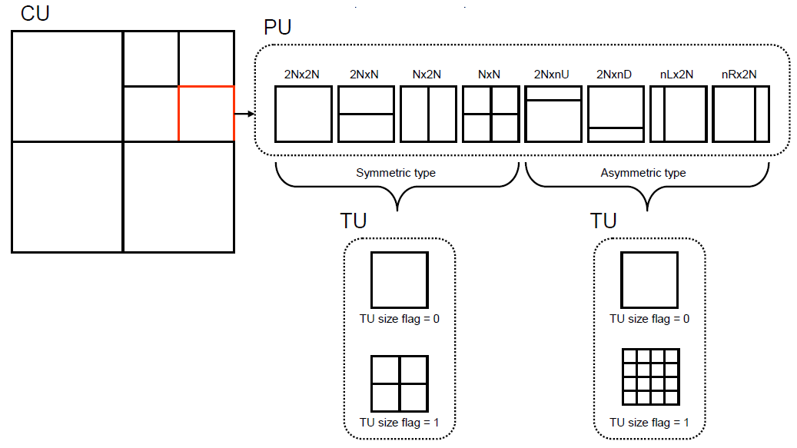
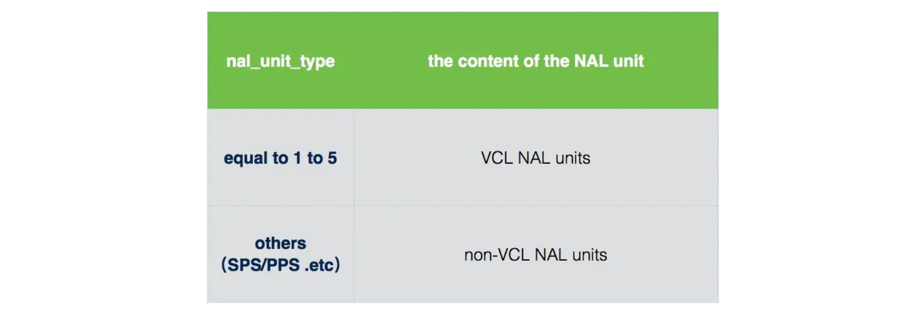
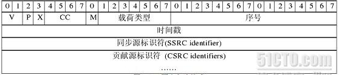
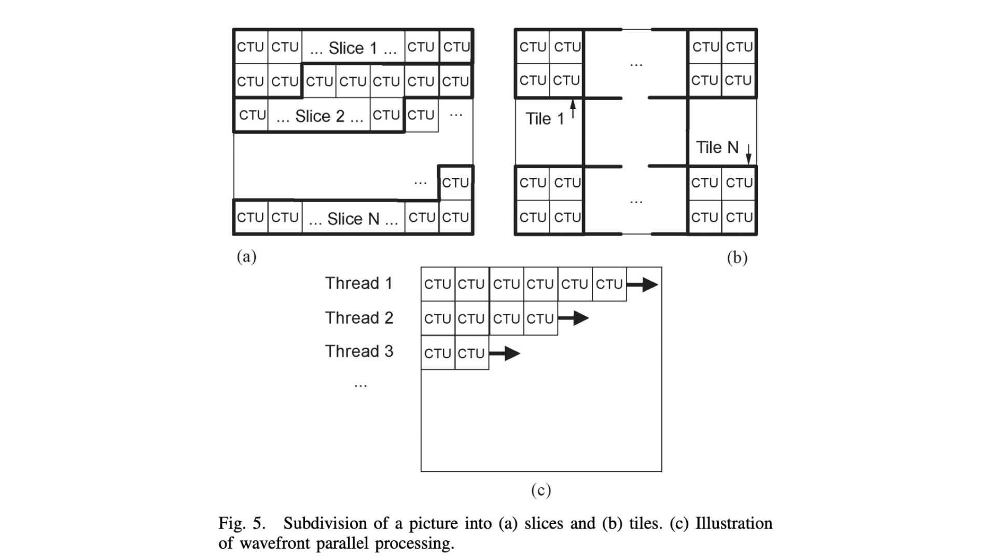
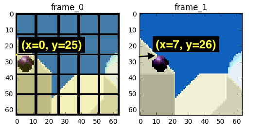
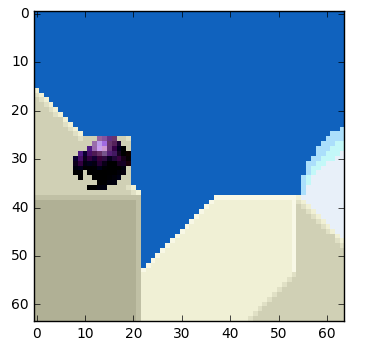
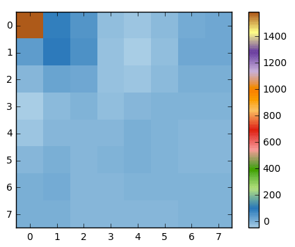
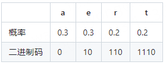

# 视频编码标准 H.264(AVC) & H.265(HEVC)

下面主要分别学习 h264、h265编码标准相关概念，细节可查阅官方协议标准

​     

# 一 H.264 & H.265标准差异

在开始前，先来简单了解H.264和H.265的标准差异

## 1 功能差异项

标准架构差异项总结：

| 功能点            | H.264 / AVC                                                  | H.265 / HEVC                                                 |
| ----------------- | ------------------------------------------------------------ | ------------------------------------------------------------ |
| MB/CU大小         | 4×4~~16×16                                                   | 4×4~~64×64                                                   |
| Inter插值         | Luma-为6抽头系数插值<br />Chroma双线性插值                   | Luma-1/2像素采用8抽头插值滤波<br />Luma-1/4像素采用7抽头插值滤波器<br />Chroma所有分数像素点采用4抽头系数插值 |
| Inter MVP预测方法 | 空域中值MVP（Motion vector prediction）预测                  | 空域+时域MVP预测候选列表（Advanced Motion Vector Prediction，AMVP）<br />空域+时域的Merge/Skip的候选列表 |
| Intra预测         | 亮度4x4块：9种模式<br />亮度8x8块：9种预测模式<br />亮度16x16块：4种预测模式<br />色度：4种预测模式预测方向：<br /> | 亮度所有尺寸的CU块：总共35种预测模式<br />色度所有尺寸的CU块：5种预测模式预测方向：<br /> |
| 变换              | DCT 4×4/8×8                                                  | DCT 4×4/8×8/16×16/32×32   DST 4×4                            |
| 滤波器            | 滤波边界：4×4和8×8边界去块滤波<br />滤波顺序：先宏块内采用垂直边界，再当前宏块内水平边界 | 滤波边界：8x8及以上的CU、PU、TU边界去块滤波<br /> 滤波顺序：先整帧的垂直边界，再整帧的水平边界<br />SAO滤波器(Sample Adaptive Offset) |
| 熵编解码技术      | CAVLC及CABAC                                                 | CABAC                                                        |
| 其他技术          | FMO映射关系等                                                | Tile、WPP以及dependent Slice                                 |

​      

## 2 H.265技术亮点

HEVC（H.265）作为新一代视频编码标准，仍然属于预测加变换的混合编码框架，然而，相对于H.264，H.265 在很多方面有了革命性的变化，其技术亮点有以下几方面。

​     

### 1）灵活编码结构

在H.265中，将宏块的大小从H.264的16×16扩展到了64×64，以便于高分辨率视频的压缩。同时，采用了更加灵活的编码结构来提高编码效 率，包括编码单元（Coding Unit）、预测单元（Predict Unit）和变换单元（Transform Unit），如下所示：



其中编码单元CU类似于H.264/AVC中的宏块MB的概念，用于编码的过程，其中预测单元PU是进行预测的基本单元，变换单元TU是进行变换和量化的基本单元。此外，这三个单元的分离，使得变换、预测和编码各个处理环节更加灵活，也有利于各环节的划分更加符合视频图像的纹理特征，有利于各个单元更优化的完成各自的功能。

​     

### 2）灵活块结构RQT / CTU

RQT（Residual Quad-tree Transform）是一种自适应的变换技术，这种思想是对H.264/AVC中ABT（Adaptive Block-size Transform）技术的延伸和扩展。

​                ● 对于帧间编码来说，它允许变换块的大小根据运动补偿块的大小进行自适应的调整

​                ● 对于帧内编码来说，它允许变换块的大小根据帧内预测残差的特性进行自适应的调整

大块的变换相对于小块的变换，一方面能够提供更好的能量集中效果，并能在量化后保存更多的图像细节，但是另 一方面在量化后却会带来更多的振铃效应，因此根据当前块信号的特性，自适应的选择变换块大小。如下所示，可以得到能量集中、细节保留程度以及图像的振 铃效应三者最优的折中。


​     

### 3）采样点自适应偏移SAO

SAO（Sample Adaptive Offset）从像素域入手降低振铃效应，**对重构曲线中出现的波峰像素添加负值进行补偿，波谷添加正值进行补偿**，由于在解码端只能得到重构图像信息，因此可以根据重构图像的特征点，通过将其划分类别，然后在像素域进行补偿处理，从而减小高频信息的失真。

在编解码环路内，位于Deblock之后，通过对重建图像的分类，对每一类图像像素值加减一个偏移，达到减少失真的目的，从而提高压缩率，减少码流。采用SAO后，平均可以减少2%~6%的码流，而编码器和解码器的性能消耗仅仅增加了约2%。


​    

### 4）自适应环路滤波ALF

ALF（Adaptive Loop Filter）在编解码环路内，位于Deblock和SAO之后，用于恢复重建图像以达到重建图像与原始图像之间的均方差（MSE）最小。

ALF的系数是在帧级 计算和传输的，可以整帧应用ALF，也可以对于基于块或基于量化树（quadtree）的部分区域进行ALF，如果是基于部分区域的ALF，还必须传递指 示区域信息的附加信息。

​    

### 5）并行化设计

当前芯片架构已经从单核性能逐渐往多核并行方向发展，因此为了适应并行化程度非常高的芯片实现，HEVC/H265引入了很多并行运算的优化思路， 主要包括以下几个方面：

#### a Tile

如下，将图像分割为矩形区域，即用垂直和水平的边界将图像划分为一些行和列，划分出的矩形区域为一个Tile，每一个Tile包含整数个LCU(Largest Coding Unit)， Tile之间可以互相独立，以此实现并行处理。其中，每个tile区域相当于一幅子图像，可以独立的以LCU块为单位进行编解码，且一个Tile块为基本的并行单元，每个Tile为一个子码流。


​     

#### b Entropy slice

Entropy Slice允许在一个slice内部再切分成多个Entropy Slices，每个Entropy Slice可以独立的编码和解码，从而提高了编解码器的并行处理能力：


​     

#### c WPP（Wavefront Parallel Processing）

WPP以LCU行为基本的编码单位，以一行LCU块为基本的并行单元，每一行LCU为一个子码流。当上一行的第二个LCU处理完毕，即对当前行的第一个LCU的熵编码(CABAC)概率状态参数进行初始化，如下所示，因此只需要上一行的第二个LCU编解码完毕，即可以开始当前行的编解码，以此提高编解码器的并行处理能力：


​     

# 二 H.264/AVC

H.264，又称为MPEG-4第10部分，高级视频编码（Advanced Video Coding，AVC）是一种面向块的基于运动补偿的编解码器标准。由ITU-T视频编码专家组与ISO/IEC联合工作组——即动态图像专家组（MPEG）——联合组成的联合视频组（JVT，Joint Video Team）开发。


​       

## 1 码流分层架构

H264/AVC 分层架构：


H264从码流功能角度可分为两层：

* **VCL层**（Video Coding Layer，视频数据编码层）：即**H264编码/压缩的核心算法引擎**，负责视频编压缩编码，包括预测（帧内预测和帧间预测）、DCT 变化和量化、熵编码和切分数据等功能，最终输出编码完的数据 SODB。
* **NAL层**（Network Abstraction Layer, 视频数据网络抽象层）：即**负责以网络所要求的恰当的方式对 VCL 数据进行打包和传送**。由于网络传输过程每个包以太网限制最多1500字节，而H264的帧往往会大于1500字节的，因此需要进行拆包传输，即将一个帧拆成多个包进行传输，当前所有的拆包或者组包都是通过NAL层去处理的。

​     

VCL 是管理 H264 的视频数据层，是为了实现更高的视频压缩比，那 VCL 究竟是怎么管理 H264 视频数据的呢？大致可分为以下3步：

* **压缩**：预测（帧内预测和帧间预测）-> DCT 转换和量化 -> 比特流编码
* **切分数据**：主要为了第三步，通常提到的 “切片（slice）”、“宏块（macroblock）” 是在VCL 中的概念，其目的一方面提高编码效率和降低误码率，另一方面提高网络传输的灵活性
* **包装**：压缩切分后的 VCL 数据会包装成为 NAL 中的一部分

​    

## 2 视频编码层 VCL

在 H264 中完全没有 I 帧、P 帧、B 帧、IDR 帧的概念，之所以沿用这些说法是为了表明数据的编码模式，且h264码流中句法元素划分为 视频序列（video sequence）、图像（frame/field-picture）、片（slice）、宏块（macroblock, 16x16）、子块（sub-block, 4x4）

VCL结构关系：


如上图H264结构，一个视频图像编码后的数据叫做一帧，一帧由一个片（slice）或多个片组成（PS：实际中，一个slice对应一整个图像），一个片又由一个或多个宏块（Macro Block, MB）组成，一个宏块由多个子块组成，子块即4x4的yuv数据，其中**宏块是H264编码的基本单位**。

   

### 1）句法元素

#### a 宏块Macroblock

宏块，即**视频信息的主要承载者**，包含着每一个像素的**亮度Y**和**色度（Cb 和 Cr）**信息，而视频解码最主要的工作则是提供高效的方式**从码流中获得宏块中的像素阵列**。

通常，一个编码图像通常划分成若干宏块组成（若干宏块被排列成片Slice的形式），其中包括宏块跳过指示符（skip macroblock indicator，即宏块没有数据），且**一个宏块由一个16×16亮度像素和附加的一个8×8 Cb和一个8×8 Cr彩色像素块组成**。


由上可知，每个宏块包含了以下信息：

* **宏块类型mb_type**：即 I / P /  B
  * I宏块：利用从当前片中已解码的像素作为参考进行帧内预测
  * P宏块：利用前面已编码图象作为参考图象进行帧内预测
  * B宏块：则利用双向的参考图象（前一帧和后一帧）进行帧内预测
* **预测类型**（mb_pred 或 sub_mb_pred）：包括 I 宏块的预测模式、P 和 B 宏块的参考帧和运动向量
* **Coded Block Pattern 编码的块模式**（CPB）：表示亮度和色度模块拥有非零残差系数（non-zero residual coefficients）
* **残差数据**（Residual data）：即非零宏块的像素的**亮度 Y**和**色度（Cb和Cr）**数据信息

​     

#### b 片slice

主要作用是**用作宏块（Macroblock）的载体**，且在每个图象中，若干宏块被排列成片的形式，其目的一方面是方便在网络中传输且更加灵活，另一方面是为了**限制误码的扩散和传输**，使每个编码slice相互间是独立传输的，即某片的预测 （片内预测和片间预测）不能以其它片中的宏块macroblock为参考图像，从而确保某一slice中的预测误差才不会传播到其它片中去。

通常，一 张/帧图像切分为一个或多个分片(Slice)，而每一个分片包含整数个宏块，即每片至少一个宏块，最多时每片包含整个图像的宏块。


​     

如下图，每个分片也包含着头header和数据data两部分：

1）**Header**：包含着切片类型、切片中的宏块类型、切片帧的数量、切片属于那个图像以及对应的帧的设置和参数等信息

2）**Data**：即宏块，也就是存储像素数据的地方


**切片类型跟宏块类型关系**：

* **I片**：只包 I宏块，I 宏块利用从当前片中已解码的像素作为参考进行帧内预测（不能取其它片中的已解码像素作为参考进行帧内预测）
* **P片**：可包 P和I宏块，P 宏块利用前面已编码图象作为参考图象进行帧内预测，一个帧内编码的宏块可进一步作宏块的分割，即 16×16、16×8、8×16 或 8×8 亮度像素块（以及附带的彩色像素）。如果选了 8×8 的子宏块，则可再分成各种子宏块的分割，其尺寸为 8×8、8×4、4×8 或 4×4 亮度像素块（以及附带的彩色像素）
* **B片**：可包 B和I宏块，B 宏块则利用双向的参考图象（当前和后续的已编码图象帧）进行帧内预测
* **SP片**（切换P）：用于不同编码流之间的切换，包含 P 和/或 I 宏块
* **SI片**：扩展档次中必须具有的切换，它包含了一种特殊类型的编码宏块，叫做** SI 宏块**，SI 也是扩展档次中的必备功能。

​     

切片类型：


​    

#### c 帧Frame和场Field

> **Q：为什么有场field概念？**
>
> **A**：人眼可察觉到的电视视频图像刷新中的闪烁为0.02秒，即如果电视系统的帧率低于50帧/秒，人眼可感觉得出画面的闪烁，常规如PAL制式电视系统帧率为25帧/秒、NTSC制式的则为30帧/秒，如果采用**逐行扫描（Progressive Scanning）**将不可避免地在视频刷新时产生闪烁现象，另一方面如果单纯的提高帧率达到避免闪烁刷新效果，则会增加系统的频带宽度。
>
> **补充**：早期由于抗干扰和滤波技术限制，电视图像的场频通常与电网频率（交流电）一致，于是根据各地的交流电频率不同，就有了欧洲与中国等的 50Hz PAL制 和 美国等的60Hz NTSC制。

​     

这便引出了**隔行扫描技术（Interlaced Scanning）**及**场field**的概念：

在隔行扫描中，每一帧包含两个场（**顶场top field** 和**底场bottom field**），其中每个field包含一帧中一半数量的水平线，即top field和bottom field分别包含了一帧中所有奇数线和偶数线。因此在电视显示过程中，电子枪每发射一行隔一行【先发射奇数行13579…(top field)，再发射2468…(bottom field)】，利用**两次扫描来完成一幅图像**，因为**视觉的滞留性**，所以看到的效果无明显闪烁现象。

​     

**总的来说**：

1）**帧**：当采用视频信号时，如果是通过**逐行扫描（Progressive Scanning）**，那么得到的信号就是一帧图像，帧频 25帧/s（PAL制）、30帧/s（NTSC制）

2）**场**：当采用视频信号时，如果是通过**隔行扫描（Interlaced Scanning）**，那么一帧图像就分为了2个场（top field和bottom field），场频 50Hz（PAL制）、 60Hz（NTSC制）

             

​     

### 2）视频压缩编码基础

#### a 图像编码方式

H264支持三种图像编码方式：

* **帧编码**：表示将一帧图像划分为16x16大小宏块进行编码，这种方式编码图像中所有宏块都是帧宏块
* **场编码**：将一帧图像根据奇数行和偶数行划分为两部分，分别成为顶场（top field）和底场（bottom field），这种方式编码的slice中所有宏块都是场宏块
* **宏块级自适应帧/场编码**：即以宏块对方式编码，其自适应性体现在宏块对可以是帧宏块对也可以是场宏块对，且编码过程中先编码顶宏块再编码底宏块，编码完一个宏块对后再编码下一个宏块对。

**注**：逐行视频帧内邻近行空间相关性强，因此当活动量非常小或静止图像比较适合采用帧编码方式，而场内相邻行间时间相关性强，对运动量较大的运动图像则审核采用场编码方式。

​    

#### b 码流编码方式

基于以上三种图像编码方式，**一段H264码流（多帧图像）**的编码方式有以下几种：

1）全部图像采用帧编码

2）全部图像采用场编码，每帧图像分为两场，即将两场合并为一帧进行编码：

* I帧 可编码为两个I场或一个I场和一个P场
* P帧 可编码为两个P场或一个P场和一个B场
* B帧 可编码为两个B场

3）图像级帧场自适应（PAFF，Picture Adaptive Frame-Field），视频序列中有些帧被编码为帧格式，有些帧被编码为场

4）全部图像编码为宏块级帧场自适应（MBAFF，MacroBlock Adaptive Frame-Field），即将两场合并为一帧，但是在宏块级别上，将一个帧宏块划分为两个场宏块进行编码


**解释说明**：

1）**运动 || 非运动**

* 对于运动图像，由于场之间存在着较大的扫描间隔，所以帧中相邻两行之间的空间相关性相对于逐行扫描图像较小，因此对来两个场分别编码会更节省码流；
* 对于非运动图像，相邻两行之间存在较大的空间相关性，将两场合并为一帧编码更有效；
* PAFF编码方式可以针对整个图像的编码方式做自适应调整，选择帧编码或场编码；

2）**运动 & 非运动**

* 当图像同时存在运动区域和非运动区域时，PAFF自适应粒度太粗，无法实现满足更加精细的编码要求，于是便引出了MBAFF；
* MBAFF对帧/场编码的选择是基于宏块的，其将两场合并为一帧进行编码，但将每一个帧宏块(16x16)划分为场宏块对(8*16)，针对每一个帧宏块，比较帧编码和场编码产生的码流大小，使用最节省码流的方式；

​     

#### c 如何分辨图像编码方式

每帧图像使用哪种编码方式再H264语法中已经定义，按照下面流程就可以解析得到编码方式：


判断过程需要用到如下三个参数，即**SPS**中的frame_mbs_only_flag / mb_adaptive_frame_field_flag 和 slice header中的field_pic_flag

* frame_mbs_only_flag：1表示序列中只有帧宏块；
* mb_adaptive_frame_field_flag：1表示视频序列中可能存在MBAFF；
* field_pic_flag：表示该slice是场编码
  * frame_mbs_only_flag=1：视频序列中所有图像都是帧格式；
  * frame_mbs_only_flag=0 && mb_adaptive_frame_field_flag=0：视频序列可能是全部是场格式，也有可能是PAFF，需要根据每一帧的field_pic_flag判断；
  * mb_adaptive_frame_field_flag=1 && field_pic_flag=1：表示该slice为场
  * mb_adaptive_frame_field_flag=1 && field_pic_flag=0：表示该帧为MBAFF

​      

### 3）视频压缩编码技术

**编码原理**：

* 空间冗余：同一幅图像的相邻像素点具有连贯性
* 时间冗余：一组连续的画面之间存在着关联性
* 结构冗余：某些场景中存在着明显的图像分布模式，有规律可循，比如方格地板，蜂窝
* 视觉冗余：人眼对图像细节的分辨率有限，对亮度比对色度更敏感
* 知识冗余：许多图像的理解和某些知识有关联，比如人类面部的固定结构

​    

在进行当前信号编码时，**编码器首先会产生对当前信号做预测的信号**，称作预测信号，也是为了解决两个方向的数据冗余。

* 时间上的预测（inter prediction）：由于视频相邻的两帧之间内容相似，使用先前帧的信号做预测
* 空间上的预测 （intra prediction）：视频的某一帧内部的相邻像素存在相似性，即使用同一张帧之中相邻像素的信号做预测

​    

如下一个典型的视频编码器：

1）在进行当前信号编码时，编码器首先会产生对当前信号做预测的信号，称作预测信号（Predicted Signal），预测的方式可以是时间上的帧间预测（Inter Prediction），亦即使用先前帧的信号做预测，或是空间上的帧内预测（Intra Prediction），亦即使用同一张帧之中相邻像素的信号做预测。

2）得到预测信号后，编码器会将当前信号与预测信号相减得到残差信号（Residual Signal），并只对残差信号进行编码，如此一来，可以去除一部分时间上或是空间上的冗余信息。

3）接着，编码器并不会直接对残差信号进行编码，而是先将残差信号经过变换（通常为离散余弦变换DCT），然后量化以进一步去除空间上和感知上的冗余信息。量化后得到的量化系数会再透过熵编码，去除统计上的冗余信息。


​    

#### a 帧内预测（Intra-frame Prediction）

**预测值与实际值位于同一帧，用于消除图像的空间冗余**，例如人眼在对图像识别时，对低频的亮度很敏感，而对高频下的亮度不太敏感，即帧内预测技术就是对人眼中不敏感的数据去除。

**大体思想**：假设现在要对一个像素 X 进行编码，在编码这个像素之前，找到它临近的像素作为参考像素 X’，根据 X’ 经过预测算法得到对像素 X 的预测值 Xp，然后再用 X 减去 Xp 得到二者的残差 D，并用这个残差 D 代替 X 进行编码，起到节省码率的作用，最后还用预测值 Xp 和残差 D 相加得到 X’ 用于下一个像素的预测。

​    

在实际编码中，固然可以按像素为单位进行预测，但这样效率比较低，所以在 H.264 标准中提出按照块为单位进行计算，其中预测块是**基于已编码重建的块和当前块形成的**，且编码器通常选择使预测块和编码块之间差异最小的预测模式，这样能大大提高计算速度。

1）亮度块：

* 4×4 亮度子块有 9 种可选预测模式，独立预测每一个 4×4 亮度子块，适用于带有大量细节的图像编码；


* 16×16 亮度块有 4 种预测模式，预测整个 16×16 亮度块，适用于平坦区域图像编码；


2）色度块：也有 4 种预测模式，类似于 16×16 亮度块预测模式

**特点**：压缩率相对较低，然而可以独立解码，不依赖其他帧的数据，通常在视频中的关键帧都采用帧内预测。

​      

#### b 帧间预测（Inter-frame Prediction）

**实际值位于当前帧，预测值位于参考帧**，用于消除图像的时间冗余（即消除时域冗余信息），简单点说就是利用之前编码过的图像来预测要编码的图像，其中涉及到两个重要的概念 **运动估计（ME，Motion Estimation）**和**运动补偿（MB，Motion Compensation）**。

* 运动估计：是寻找当前编码的块在已编码的图像（参考帧）中的最佳对应块，并且计算出对应块的偏移（运动矢量）
* 运动补偿：是根据运动矢量和帧间预测方法，求得当前帧的估计值过程，其实就是将运动矢量参数贴到参考帧上获取当前帧，另外运动补偿是一个过程

​     

H264 帧间预测是利用已编码视频帧/场和基于块的运动补偿的预测模式，与以往标准帧间预测的区别在于块尺寸范围更广（从 16×16 到 4×4）、亚像素运动矢量的使用（亮度采用 1/4 像素精度 MV）及多参考帧的运用等等。

1）亮度块

* 每个宏块（16×16 像素）可以 4 种方式分割：一个 16×16，两个 16×8，两个 8×16，四个 8×8，其运动补偿也相应有四种，其次 8×8 模式的每个子宏块还可以四种方式分割：一个 8×8，两个 4×8 或两个 8×4 及 4 个 4×4，此外些分割和子宏块大大提高了各宏块之间的关联性，因而这种分割下的运动补偿则称为树状结构运动补偿。


* 其次，每个分割或子宏块都有一个独立的运动补偿，且每个 MV 必须被编码、传输，分割的选择也需编码到压缩比特流中（PS：分割尺寸的选择影响了压缩性能）
  * **大分割尺寸**， MV 选择和分割类型只需少量的比特，但运动补偿残差在多细节区域能量将非常高，**适合平坦区域**
  * **小尺寸分割**，运动补偿残差能量低，但需要较多的比特表征 MV 和分割选择，**适合多细节区域**

2）色度块 （Cr 和 Cb）：则为相应亮度的一半（水平和垂直各一半），采用和亮度块同样的分割模式，只是尺寸减半（水平和垂直方向都减半），例如 8×16 的亮度块相应色度块尺寸为 4×8，8×4 亮度块相应色度块尺寸为 4×2 等等，此外色度块的 MV 也是通过相应亮度 MV 水平和垂直分量减半而得。

**特点**：帧间预测的压缩率高于帧内预测，然而不能独立解码，必须在获取参考帧数据之后才能重建当前帧。

​    

#### c 变换Transform 和 量化Quantizer

绝大多数图像都有一个共同的特征，即**平坦区域和内容缓慢变化区域占据一幅图像的大部分，而细节区域和内容突变区域则占小部分**，换句话说，图像中直流和低频区占大部分，高频区占小部分。这样空间域的图像变换到频域或所谓的变换域，会产生相关性很小的一些变换系数，并可对其进行压缩编码，即所谓的**变换编码**。

此外，为了**减小图像编码的动态范围**，一般也会进行**量化**，且在图像编码中，变换编码和量化从原理上讲是两个独立的过程。但在 H.264 中，将两个过程中的乘法合二为一，并进一步采用整数运算，减少编解码的运算量，提高图像压缩的实时性。

H264 对图像或预测残差采用了 4×4 整数离散余弦变换（DCT）技术，避免了以往标准中使用的通用 8×8 离散余弦变换逆变换经常出现的失配问题，而量化过程根据图像的动态范围大小确定量化参数，既保留图像必要的细节，又减少码流。


​     

#### d 熵编码 Entropy（CAVLC & CABAC）

熵的大小与信源的概率模型有着密切的关系，各个符号出现的概率不同，信源的熵也不同。当信源中各事件是等概率分布时，熵具有极大值，其中**信源的熵与其可能达到的最大值之间的差值反映了该信源所含有的冗余度**。信源的**冗余度越小**，即**每个符号所独立携带的信息量越大**，那么传送相同的信息量所需要的序列长度越短，符号位越少。因此，数据压缩的一个基本的途径是**去除信源的符号之间的相关性**，尽可能地使序列成为无记忆的，即**前一符号的出现不影响以后任何一个符号出现的概率**。

**熵编码**：即统计编码，利用信源的统计特性进行码率压缩的编码就称为熵编码，同时也是无损压缩编码方法，它生成的码流可以经解码无失真地恢复出原数据。

常用熵编码方式：指数哥伦布编码（UVLC）、变长编码（Context-based Adaptive Variable-Length Coding，CAVLC）、二进制算术编码（Context-based Adaptive Binary Arithmetic Coding，CABAC）等

​     

## 3 网络抽象层 NAL

NAL，即Network Abstraction Layer，与H264 压缩算法无关，其目的就是为了获得 “network-friendly”，即为了实现良好的网络亲和性，即可适用于各种传输网络。


​     

### 1）NALU（NAL Unit）

H.264码流在网络中传输时实际是以NALU的形式进行传输的，其结构如下：


由上可知，NALU 由 header 和 payload 两部分组成：

1）**header**：一般**存储标志信息**，譬如 NALU 的类型，一般情况下NAL 会打包 VCL 数据，但是这并不意味着所有的 NALU 负载的都是 VCL，也有**一些 NALU 仅仅存储了和编解码信息相关的数据**；

2）**payload**：存储了真正的数据，但实际上这块也会相对比较复杂，之前提到H264 的一个目的就是能够很好地适配各种传输格式，所以根据实际采用数据传输流格式，也会对这部分数据格式再进行处理。

   

### 2）NALU header（SPS & PPS）

**NALU Header只占 1 个字节**，即 8 位，其组成如下图所示：


其中

1）**forbidden_zero_bit**（1bit）：禁止位，初始为0，当网络发现NAL单元有比特错误时可设置该比特为1，以便接收方纠错或丢掉该单元

2）**nal_ref_idc**（2bit）：用于表示当前NALU的重要性，值越大（0～3），越重要，且解码器在解码处理不过来的时候，可以丢掉重要性为 0 的 NALU，其次当前的 **NAL 是参考帧，序列集参数集SPS或图像集重要数据 PPS时必须大于0**。

* !=0时，NAL unit的内容可能是 SPS/PPS/参考图像帧的片等
* ==0时，NAL unit的内容可能是非参考图像的片等，其次当某个图像的片的nal_ref_id等于0时，该图像的所有片均应等于0

3）**nal_unit_type**（5bit）：表示 NALU 数据的类型，有以下几种：


需要注意的是：

* 1-4：**I/P/B帧**，依据VLC的slice区分的，如果 nal_ref_idc 为 0，则表示 I 帧，不为 0 则为 P/B 帧
* 5：**IDR帧**，I 帧的一种，告诉解码器，之前依赖的解码参数集合（接下来要出现的 SPS\PPS 等）可以被刷新了
* 6：**SEI**，英文全称 Supplemental Enhancement Information，即“**补充增强信息**”，提供了向视频码流中加入额外信息的方法
* 7：**SPS**，全称 Sequence Paramater Set，即“**序列参数集**”，且SPS 中保存了一组编码视频序列（Coded Video Sequence）的全局参数，因此该类型保存的是和编码序列相关的参数
* 8：**PPS**，全称 Picture Paramater Set，即“**图像参数集**”，该类型保存了整体图像相关的参数
* 9：**AU 分隔符**，AU 全称 Access Unit，它是**一个或者多个 NALU 的集合**，代表了一个完整的帧，有时候用于解码中的帧边界识别

​     

**判断类型举例**：

```shell
假设起始码 0x00000001 后有67, 68, 65, 41, 61, ...
1）0x67的二进制码 0110 0111：4-8为00111，转为十进制7，对应序列参数集SPS
2）0x68的二进制码 0110 1000：4-8为01000，转为十进制8，对应图像参数集PPS
3）0x65的二进制码 0110 0101：4-8为00101，转为十进制5，对应IDR图像中的片(I帧)
4）0x41的二进制码 0100 0001：4-8为00001，转为十进制1，对应非IDR图像中的片(这里指的是P帧)
5）0x61的二进制码 0110 0001：4-8为00001，转为十进制1，对应非IDR图像中的片(同上，为P帧，仅仅是重要性不同)
6）0x06的二进制码 0000 0100：4-8为00100，转为十进制6，对应SEI
```

**补充：**

1）nal_unit_type 从**是否包含VCL层编码数据**分为 VCL NAL units 和 non-VCL NAL units，其中VCL NAL units中包含VCL层编码输出的数据，而non-VCL NAL units不包括



2）**AU分割**：一个单独的NALU包、或者甚至一个VCL NALU包都不意味着是一个独立的帧，一帧数据可以被分割成几个NALU，一个或多个NALU组成了一个Access Units(AU)，AU包含了一个完整的帧。**把帧分割成几个独立的NALU需要耗费许多CPU资源，所以分割帧数据并不经常使用**。

​      

### 3）NALU payload（SODB/RBSP/EBSP）

NALU payload相关组成概念：

* **SODB**（String of Data Bits, 原始数据比特流） ：即最原始的编码/压缩的比特流数据，长度不一定是8的倍数，是由VCL层产生的，因为非8的倍数所以处理比较麻烦；
* **RBSP**（Raw Byte Sequence Payload, 原始字节序列载荷）：即**RBSP = SODB + RBSP Trailing Bits**，引入RBSP Trailing Bits尾部补齐8位字节


* **EBSP**（Encapsulate Byte Sequence Payload，扩展字节序列载荷）：即 **EBSP = RBSP插入防竞争字节（0x03）**，就是生成压缩流之后，还要在每个帧之前加一个起始位。

  **防止竞争字节**：由于起始位（StartCode）一般是十六进制的0001，但是在整个编码后的数据里，可能会出来连续的2个0x00，那这样就与起始位产生了冲突。那怎么处理了？H264规范里说明如果处理2个连续的0x00，就额外增加一个0x03，这样就能预防压缩后的数据与起始位产生冲突

* **NALU**（NAL Unit）：即**NAL Header(1B)+EBSP**，就是在EBSP的基础上加1B的网络头，属h264的实际数据部分

总的来说：**NALU = NALUHeader+EBSP，EBSP = 防止竞争码(0x03) + RBSP，RBSP = SODB + RBSP尾部**

​    

**补充**：

| 相关功能点                    | 说明                                                         |
| ----------------------------- | ------------------------------------------------------------ |
| 1）**EBSP防竞争字节（0x03）** | 即 EBSP相较于RBSP，多了防止竞争的一个字节 0x03<br /><br />由上可知，每个NAL（NALU）前有一个起始码StartCode **0x000001**（或者 **0x00000001**），同时H.264规定，当检测到 0x000001时，也可以表征当前NAL的结束，那么如果NAL中数据出现0x000001或0x000000时怎么办？<br />因此，H.264引入了防止竞争机制，即如果编码器检测到NAL数据存在 0x000001或0x000000时，编码器会**在最后个字节前插入一个新的字节0x03**，这样解码器检测到EBSP内有0x000003时，把03抛弃，就能得到原始字节序列载荷RBSP（脱壳操作）<br /><br /><br />**注**：解码器在解码时，首先逐个字节读取NAL的数据，统计NAL的长度，然后再开始解码 |
| 2）**RBSP尾部补齐**           | RBSP的尾部，在规定中有以下两种：<br />1）**RBSP尾部**<br />其中大多数类型的NALU，使用这种尾部<br /><br />其中，<br />a.  rbsp_stop_one_bit 占1个比特位，值为1<br />b.  rbsp_alignment_zero_bit 值为0，目的是为了进行字节对齐，占据若干比特位因此，此时RBSP尾部就等于，SODB在它的最后一个字节的最后一个比特后，紧跟值为1的1个比特，然后增加若干比特的0，以补齐这个字节。<br /><br />2）**条带RBSP尾部**<br />当NALU类型为条带时，也即nal_unit_type等于1~5时，这时RBSP使用下面这种尾部：<br /><br />可以看到，rbsp_slice_trailing_bits()默认情况下，就是上述介绍的第一种尾部。只是当entropy_coding_mode_flag值为1，也即当前采用的熵编码为**CABAC**，而且more_rbsp_trailing_data() 返回为true，也即RBSP中有更多数据时，添加一个或多个0x0000。<br />所以解码器拿到RBSP，只需要按照上述语法，去掉RBSP的尾部，就可以得到SODB，然后就可以对照对应类型的NALU的句法，解析出语法元素的值。 |

​     

### 4）特殊NALU：SPS和PPS

**SPS 和 PPS 存储了编解码需要一些图像参数**，因此SPS、PPS 需要在 I 帧前出现，不然解码器没法解码，且SPS、PPS 出现的频率也跟不同应用场景有关，对于一个本地 h264 流，可能只要在第一个 I 帧前面出现一次就可以，但对于直播流，每个 I 帧前面都应该插入 sps 或 pps，因为直播时客户端进入的时间是不确定的。

* **SPS**：序列参数集，作用于一串连续的视频图像，其中包含seq_parameter_set_id、帧数及POC（Picture order Count）的约束、参考帧约束、解码图像尺寸和帧场编码模式选择标识等信息
* **PPS**：图像参数集，作用于视频序列中的图像，其中包含pic_parameter_set_id、熵编码模式选择标识、片组数目、初始量化参数和去方块滤波系数调整标识等信息


​     

下面主要介绍SPS中的重要参数 **Profile** 和 **Level**

#### a Profile（压缩特性）

即**对视频压缩特性的描述**，主要是定义了编码工具的集合，**Profile越高，就说明采用了越高级的压缩特性**

H.264有四种画质级别，分别是baseline, main, high

* 1）**Baseline Profile**：基本画质，支持I/P 帧，只支持无交错（Progressive，逐行扫描）和CAVLC； 
* 2）**Extended profile**：进阶画质，支持I/P/B/SP/SI 帧，只支持无交错（Progressive，逐行扫描）和CAVLC；
* 3）**Main profile**：主流画质，提供I/P/B 帧，支持无交错（Progressive，逐行扫描）和交错（Interlaced，隔行扫描）， 支持CAVLC 和CABAC 的熵编码； 
* 4）**High profile**：高级画质，在main Profile 的基础上增长了8x8内部预测、自定义量化、 无损视频编码和更多的YUV 格式，支持CAVLC 和CABAC 的熵编码； 

H.264 Baseline profile、Extended profile和Main profile 都是针对8位样本数据、4:2:0格式(YUV)的视频序列，其次在相同配置状况下，High profile（HP）能够比Main profile（MP）下降10%的码率。 通常情况，Baseline profile多应用于实时通讯领域，Main profile多应用于流媒体领域，High profile则多应用于广电和存储领域。 

最新详情可参考  [H.264：Advanced video coding for generic audiovisual services](https://www.itu.int/rec/T-REC-H.264)

   

#### b Level（支持的视频特性）

即对视频的描述，**Level越高，视频的码率、分辨率、fps越高**，即如下可知设置不同level，编码支持的最大分辨率大小是不一样的。


更多详情参考 [Profiles and Levels in H.264/AVC](https://vocal.com/video/profiles-and-levels-in-h-264-avc/) 

​    

### 5） H264句法元素解析流程

由上可知，当解码器拿到RBSP或SODB之后，就可以对照各类型的NALU，去解析它们的语法元素，进而再根据语法元素，重建图像。

其中解析语法元素的框图如下：


由图可见，解析NALU的各个句法元素并不难，只要根据h264文档对应章节的句法，并配合相应的编解码算法解析即可。

​     

## 4 H264格式（封装）

H.264的两种打包/封装方法，即**字节流AnnexB格式** 和 **AVCC格式** ，但在H264用于**网络发送**时，要封装成RTP格式！！！

* AnnexB格式：用于实时播放
* AVCC格式：用于存储
* RTP格式：用于网络发送

​      

### 1）AnnexB格式 -- 实时播放

AnnexB流结构：使用start code分隔NAL，且SPS和PPS按流的方式写在头部。


**两种起始码start_code**：

1）**3字节（0x00 00 01）**：单帧多slice（即单帧多个NALU）之间间隔

2）**4字节（0x00 00 00 01）**：帧间或者SPS、PPS等之前

4字节类型的起始码在连续的数据传输中非常有用，因为**用字节来对齐、分割流数据**，比如用连续的31个bit 0 后接一个bit 1 来分割流数据，是很容易的，因此一般情况下start_code使用四字节分割NAL。

如果某个**NALU包之后的bit是0**（因为每个NALU都以bit0开始），那么一般就是**一个NALU包数据的起始位置了**。通常，**在4字节类型的开始码只用于标识流中的随机访问点，如SPS，PPS，AUD和IDR，然后其他地方都用3字节类型的开始码以减少数据量**。

​     

**防止竞争字节（0x03）**：

前面讲到用StartCode的字节串来分割NALU，于是问题来了，如果RBSP中也包括了StartCode（0x000001或0x00000001）怎么办呢？所以，就有了防止竞争字节（0x03）：

* 编码时，扫描RBSP，如果遇到连续两个0x00字节，就在后面添加防止竞争字节（0x03）


* 解码时，同样扫描EBSP，进行逆向操作即可，即在解码的时，如果在内部遇到0x000003序列，就可以将其抛弃即可以恢复原始数据。

​     

**AnnexB格式每个NALU都包含起始码**，且通常会**周期性的在关键帧之前重复SPS和PPS **（在I帧之前，且SPS和PPS存储了编解码需要一些图像参数），所以解码器可以**从视频流随机点开始进行解码**，实时的流格式如下示例：


​    

### 2）AVCC格式 -- 存储

AVCC格式是另一个存储H.264流的方式，且AVCC流结构：


AVCC中的NALU格式，与AnnexB格式一致。当将AVCC转AnnexB时，如果检测到NALU Type = 5关键帧，那么在关键帧前面加上 **SPS** NALU和 **PPS** NALU即可。**虽然AVCC格式不使用起始码，防竞争字节还是有的，所以我们在转换AVCC与AnnexB格式的时候，不用考虑防竞争字节，因为NALU内部是一致的**。

其次，在这种格式中，每一个NALU包都加上了一个**指定其长度（NALU包大小）的前缀**（in big endian format，大端格式），这种格式的包非常容易解析，但是这种格式**去掉了Annex B格式中的字节对齐特性**，而且前缀可以是1、2或4字节，这让AVCC格式变得更复杂了，**指定前缀字节数（1、2或4字节）的值保存在一个头部对象中**（流开始的部分），通常称为 **extradata** 或者 **sequence header**。

> **大端方式**：高地址放低位，比如 0000 0001，按2字节存放时，就是高地址<越往后越高>放低位01，低地址存放高位00

​    

头部 **extradata** 或 **sequence header** 分析：


1）其中 extradata 前4字节无用，跳过即可

2）第5个字节：**前6位保留**，全部置为1，即 '111111'b，后两位为 **NALULengthSizeMinusOne字段** 用于告诉我们NALU前缀大小

* =0 对应前缀1字节，对应每个NALU包最大长度255字节
* =1 对应前缀2字节 对应每个NALU包最大长度64K

3）第6个字节：前3位保留，全部置为1，即('111'b)，后5位用于存放SPS NALU的个数（通常为1个）

4）取决于第6个字节中指定的SPS NALU个数，开始进行循环获取SPS数据

* 接下来获取两个字节：采用两个字节，作为前缀，指示接下来的一个SPS NALU的大小"N"（字节数），且每次获取一个SPS NALU单元数据，都需要先获取其前缀信息
* 接下来获取N个字节：获取SPS的数据

5）获取全部SPS数据后，开始获取PPS数据，**获取1个字节，内部存放了PPS NALU单元的个数**（通常为1个）

6）取决于前1个字节中指定的PPS NALU个数，开始进行循环获取PPS数据

* 接下来获取两个字节：采用两个字节，作为前缀，指示接下来的一个PPS NALU的大小"N"（字节数）。每次获取一个PPS NALU单元数据，都需要先获取其前缀信息
* 接下来获取N个字节：获取PPS的数据

可知，**SPS和PPS被存储在了非NALU包中**（out of band带外），即独立于基本流数据，这些数据的存储和传输是文件容器的任务，超出了本文的范畴。

​    

**总的来说，AVCC格式**：

1. 使用**NALU长度分隔NAL**，其中长度固定字节（通常为4字节），取决于头部的NALULengthSizeMinusOne字段；
2. 在头部包含 extradata 或sequence header的结构体（**extradata包含分隔的字节数、SPS和PPS**）
3. **解码器配置参数在一开始就配置好了**（所以不能像视频网站中的实时播放一样可以在中间修改参数，比如：帧率，画面），系统可以很容易的识别NALU的边界，不需要额外的起始码，减少了资源的浪费，同时可以在播放时调到视频的中间位置。这种格式通常被**用于可以被随机访问的多媒体数据**，如存储在硬盘的文件：MP4、MKV通常用AVCC格式来存储。

​     

### 3）RTP格式 -- 网络传输

**RTP封装 = 12字节固定RTP包头 + 载荷（NALU）**

**补充**：即针对IP网络的RTP打包方式，是原始的NAL打包格式，开始的若干字节（1，2，4字节）是NAL的长度，而不是start_code，此时必须借助某个全局的数据来获得编码器的profile, level, PPS, SPS等信息才可以解码。（AVCC格式）？？？

#### a RTP包头

前12字节固定 + (0~15)个32位的CSRC标识符



* V (2bits)：RTP协议的版本号，当前协议版本号为2
* P (1bit)：填充标志，如果设置填充位P=1，在包尾将包含附加填充字节，它不属于有效载荷。填充的最后一个八进制包含应该忽略的八进制计数。某些加密算法需要固定大小的填充字节，或为在底层协议数据单元中携带几个RTP包
* X (1bit)：扩展标志，如果X=1，则在RTP报头后跟有一个扩展报头
* CC(4bits)：CSRC计数器，指示CSRC 标识符的个数
* Ｍ (1bit)：标记位（不同载荷含义不同，视频标记一帧的最后一个分片slice则=1,其他=0）
* PT (7bits)：载荷类型RTP_PAYLOAD_RTSP,记录后面资料使用哪种 Codec，receiver 端找出相应的 decoder 解碼出來，例如H264=96
* 序列号(16bits)：用于标识发送者所发送的 RTP 报文的序列号（初始值随机），每发送一个报文，序号增加 1
* 时间戳(32bits)：时间戳反映了该 RTP 报文的第一个八位组的采样时刻。 接受者使用时间戳来计算延迟和抖动， 并进行同步控制
* SSRC(32bits)：区分是在和谁通信。值随机选择，参加同一视频会议的两个同步信源的SSRC要相同
* 贡献源(CSRC)标识符(32bits)：每个CSRC标识符占32位，可以有0～15个。每个CSRC标识了包含在该RTP报文有效载荷中的所有特约信源。

​    

RTP 协议实际上是由**实时传输协议RTP**（Real-time Transport Protocol）和**实时传输控制协议RTCP**（Real-time Transport Control Protocol）两部分组成

* RTP 协议基于多播或单播网络为用户提供连续媒体数据的实时传输服务
* RTCP 协议是 RTP 协议的控制部分，用于实时监控数据传输质量，为系统提供拥塞控制和流控制

   

#### b 回顾NALU类型


* F：forbidden_zero_bit，1 个比特，在 H.264 规范中规定了这一位必须为 0
* NRI：nal_ref_idc，2 个比特，取 00 ~ 11，似乎指示这个 NALU 的重要性，如 00 的 NALU 解码器可以丢弃它而不影响图像的回放，不过一般情况下不太关心这个属性
* Type：nal_unit_type，5 个比特，这个 NALU 单元的类型


​       

#### c 打包模式

在IP网络中，当要传输的IP报文大小超过【**最大传输单元MTU**】时就会**产生IP分片**情况，因此若**交给底层协议拆包容易出问题，则需要主动拆分NALU再打包成RTP包后发送**。

H264的RTP中有三种不同的封包模式（Single NAL, Non-interleaved, Interleaved） 通过**SDP参数**中指定，如：

```xml
m=video 49170 RTP/AVP 98
a=rtpmap:98 H264/90000
a=fmtp:98 profile-level-id=42A01E; packetization-mode=1; sprop-parameter-sets=Z0IACpZTBYmI,aMljiA==
```

其中，

* **packetization-mode**决定封包模式
  * 0 时或不存在：必须使用单一 NALU 单元模式.（无此字段时，缺省为0） 单包
  * 1 ：必须使用非交错（non-interleaved）封包模式，即FU-A
  * 2 ：必须使用交错（interleaved）封包模式，即FU-B

* **sprop-parameter-sets**：SPS,PPS，即**用于传输 H.264 的序列参数集和图像参数 NAL 单元**，这个参数的值采用 Base64 进行编码（若不用Base64则可能会有数据丢失），不同的参数集间用","号隔开
* **profile-level-id**：用于指示 H.264 流的 profile 类型和级别，由 Base16(十六进制) 表示的 3 个字节
  * 第一个字节表示 H.264 的 Profile 类型
  * 第三个字节表示 H.264 的 Profile 级别

​    

**打包方式总结**：


```shell
① single NAL unit packet　单包（1个RTP包：1个NALU）
② aggregation packets　　 聚合(组合)包（1个RTP包：多个NALU，提高传输效率），需要解包时在重组。
　　① STAP (Single-time aggregation packet)
　　　　STAP-A
　　　　STAP-B
　　② MTAP (Multi-time aggregation packet)
　　　　MTAP16
　　　　MTAP24
③ Fragmentation Unit　　拆包处理【一个NALU→多包　NALU＞最大传输单元MTU】
　　　　FU-A　　//非交错模式
　　　　FU-B　　//交错模式
```

   

简介：

| 打包类型                                                     | 说明                                                         |
| ------------------------------------------------------------ | ------------------------------------------------------------ |
| 1）单一NALU的RTP包                                           | 对于 **NALU 的长度小于 MTU 大小的包**，一般采用单一 NAL 单元模式<br /><br />对于一个原始的 H.264 NALU 单元常由 **[Start Code] [NALU Header] [NALU Payload]** 三部分组成，其中 Start Code 用于标示这是一个NALU 单元的开始，必须是 "00 00 00 01" 或 "00 00 01", NALU 头仅一个字节，其后都是 NALU 单元内容。**打包时去除 "00 00 01" 或 "00 00 00 01" 的开始码，把其他数据封包的 RTP 包即可**。<br /><br /><br />**举例**：<br />1) 如有一个 H.264 的 NALU ：**[00 00 00 01 67 42 A0 1E 23 56 0E 2F ... ]**<br />即序列参数集 NAL 单元，[00 00 00 01] 是四个字节的开始码，67 是 NALU 头，42 开始的数据是 NALU 内容<br />2) 封装成 RTP 包将如下：**[ RTP Header ] [ 67 42 A0 1E 23 56 0E 2F ]**<br />即只要去掉 4 个字节的开始码就可以了 |
| 2）组合NALU的RTP包                                           | 当 **NALU 的长度特别小**时，可以把几个 NALU 单元封在一个 RTP 包中<br />PS：这里只介绍STAP-A模式，如果是STAP-B的话会多加入一个DON域，另外还有MTAP16、MTAP24<br /><br /><br />**举例**：<br />1）如有一个 H.264 的 NALU 是这样的：<br />[00 00 00 01 67 42 A0 1E 23 56 0E 2F ... ]<br />[00 00 00 01 68 42 B0 12 58 6A D4 FF ... ]<br />2）封装成 RTP 包将如下<br />[ RTP Header ] [78 (STAP-A头，占用1个字节)] [第一个NALU长度 (占用两个字节)] [ 67 42 A0 1E 23 56 0E 2F ] [第二个NALU长度 (占用两个字节)] [68 42 B0 12 58 6A D4 FF ... ] |
| 3）分片NALU的RTP包：FU_indicator和FU_head（RTP分包时的包头） | 当**NALU的长度超过MTU**时，就必须对NALU单元进行分片封包，也称为Fragmentation Units（FUs）<br /><br /><br />**FU-A的分片格式**：数据比较大的H264视频包，被RTP分片发送，12字节的RTP头后面跟随的就是FU-A分片<br /><br /><br />**FU_indicator**：<br />1）F　　禁止位<br />2）NRI　重要标识位，即拆包的nalu自身的NRI，F与NRI 保存了 NALU的前3位<br />3）type　RTP打包头类型，FU-A时type=28<br /><br />**FU_header**：<br />1）S        开始位　1表示分片NAL单元的开始，反之=0<br />2）E　　结束位　1表示分片NAL单元的结束，反之=0<br />3）R　　保留位　必须为0，接收者必须忽略该位<br />4）type　NALU数据类型 NALU_header，保存了 NALU 类型（即NALU的后5位）<br /><br />**FU_header**例子：<br />-- 0x7C85=01111100 10000101 (开始包) <br />-- 0x7C05=01111100 00000101 (中间包) <br />-- 0x7C45=01111100 01000101 (结束包)<br /><br />**举例**：<br />1）如有一个 H.264 的 NALU <br />[00 00 00 01 65 42 A0 1E 23 56 0E 2F ...  02 17 C8 FD F1 B9 C7 53 59 72 ... CB FF FF F4 1A D5 C4 18 A8 ... F1 B9 C7 1D A5 FA 13 0B ...]  <br />2）封装成 RTP 包将如下（注意：**下面去掉了开始码和NALU头部，但是在FU_header的type存放了NALU数据类型**）<br />[ RTP Header ] [ 7C 85 42 A0 1E 23 56 0E 2F ...]<br />[ RTP Header ] [ 7C 05 02 17 C8 FD F1 B9 C7 53 59 72 ...]<br />[ RTP Header ] [ 7C 05 CB FF FF F4 1A D5 C4 18 A8 ...]<br />[ RTP Header ] [ 7C 45 F1 B9 C7 1D A5 FA 13 0B ...]<br /><br />**补充**：拆包和解包<br />1）发送端—拆包：NAL_header与分片后的FU的单元头有如下关系：<br />-- NAL_header前三位为FU_indicator的前三位<br />-- NAL_header后五位为FU_header的后五位<br />2）接收端—解包：将所有的分片包组合还原成原始的NAl包<br />nal_unit_type = (fu_indicator & 0xe0) \| (fu_header & 0x1f) |

​     

# 二 H.265/HEVC

视频编码的目的是为了压缩原始视频，压缩的主要思路是从空间、时间、编码、视觉等几个主要角度去除冗余信息。由于 H.264 出色的数据压缩比率和视频质量，成为当前市场上最为流行的编解码标准。而 H.265 是在 H.264 的基础上，保证相同视频质量的同时，视频流的码率还可以减少50%。

H.265 的编码框架流程图：


   

## 1 分层结构

与H.264/AVC 类似，H265/HEVC也采用**视频编码层**（Video Coding Layer，VCL）和**网络抽象层**（Network Abstract Layer, NAL）的双层结构，以适应不同网络环境和视频应用

* **VCL**：主要包括视频压缩引擎和图像分块的语法定义，原始视频在 VCL 层，被编码成视频数据。简单版本的编码过程如下：
  * 1）将每一帧的**图像分块**，将块信息添加到码流中；
  * 2）对单元块进行**预测编码**，帧内预测生成**残差**，帧间预测进行**运动估计**和**运动补偿**；
  * 3）对残差进行**变换**，对变换系数进行**量化**、扫描；
  * 4）对量化后的变换系数、运动信息、预测信息等进行**熵编码**，形成压缩的视频码流输出

* **NAL**：Network Abstraction Layer，主要**定义数据的封装格式**，把 VCL 产生的**视频数据（视频压缩后的数据）封装成一个个 NAL 单元的数据包**，并进行必要的标识，适配不同的网络环境并传输。

   

## 2 视频编码层VCL

### 1）分块 Partitioning

HEVC编码结构的主要目的就是为了各种应用下操作的灵活性以及数据损失的鲁棒性，即是指控制系统在一定的参数摄动下，维持其它某些性能的特性。从GOP（Group of Pictures）至Slice，从Slice至SS（Slice Segment），从SS至CTU（Coding Tree Unit），从CTU至CU（Coding Unit）的过程就是编码时的分层处理架构。

从编码顺序和结构上讲，H.265首先将一个视频划分成若干个**序列Sequence**，一个序列划分成若干个**图像组（GOP）**，每一个GOP代表一组连续的视频帧。H.265 在对图像做预测编码和变换编码时，会先对图像进行划分，划分方式是四叉树，即将整个视频帧划分成若干个正方形的**编码树块**（CTB，coding tree block），CTB 可以继续划分成**编码块**（CB, coding block），CB 还可以划分为**预测块**（PB, prediction block）和**变换块**（TB, transform block），而从CTB至CB的过程就是编码时的分层处理架构，如下图所示：


​    

#### a 图像组GOP

视频序列由若干时间连续的图像构成，在对其进行压缩时，先将该视频序列分割为若干个小的图像组（Group of Pictures,GOP），GOP分为封闭式GOP（Closed GOP）和开放式GOP（Opened GOP）。

| 类型      | 说明                                                         |
| --------- | ------------------------------------------------------------ |
| 封闭式GOP | 如下图，每个GOP以IDR图像开始，各个GOP之间独立编解码<br /> |
| 开放式GOP | 第一个GOP的第一个帧内编码图像为IDR图像，后续GOP中的第一个帧内编码图像为non-IDR图像，也就是说，后面GOP中的帧间编码图像可以越过non-IDR图像，使用前一个GOP中的已编码图像做参考图像。<br /> |

​    

#### b 片Slice 和 SS

**每个GOP又被划分为多个片（Slice），片与片之间进行独立编码**，其主要目的之一是在数据丢失情况下进行重新同步，且在HEVC中，默认情况下，**一个GOP分为4个片，每个片就是一帧图像**。

如下图所示，**每个片由一个或多个片段（Slice Segment, SS）组成**，目前在HEVC中，默认情况下，一个片中只包含一个片段，也就是说，一帧图像就是一个片，也是一个片段。


​    

#### c Tile

Tile是HEVC中新提出的概念，**一幅图像不仅仅可以划分为若干个Slice，还可以划分为若干个Tile**，即从水平和垂直方向将一幅图像分割为若干个矩形区域，**一个矩形区域就是一个Tile**，如下图所示。每个Tile包含整数个CTU，其可以独立解码，且划分Tile的主要目的是**在增强并行处理能力的同时又不引入新的错误扩散**，此外Tile提供比CTB更大程度的并行（在图像或者子图像层面上），在使用时无需进行复杂的线程同步。


Tile的划分并不要求水平和垂直边界均匀分布，可根据并行计算和差错控制的要求灵活掌握。通常情况下，每一个Tile中包含的CTU数据是近似相等的，且**在编码时，图像中的所有Tile按照扫描顺序进行处理，每个Tile中的CTU也按照扫描顺序进行编码**。

**注**：一个Tile包含的CTU个数与Slice中的CTU个数互不影响，在同一幅图像中，可以同时存在某些Slice中包含多个Tile和某些Tile中包含多个Slice的情况。

​    

Slice与Tile划分的目的都是为了进行独立解码，但是二者的划分方式又有所不同，其中Tile形状基本上为矩形，Slice的形状则为条带状。此外，**Slice由一系列的SS组成，一个SS由一系列的CTU组成，而Tile则直接由一系列的CTU组成**。



但Slice/SS和Tile之间也必须遵循一些基本原则，每个Slice/SS和Tile至少要满足以下两个条件之一：

1）一个Slice/SS中的所有CTU属于同一个Tile；

2）一个Tile中的所有CTU属于同一个Slice/SS；

​    

#### d 编码树单元CTU

为了更灵活、更有效地表示视频内容，HEVC中还引入了编码树单元CTU（Coding Tree Unit），每个CTU包括一个亮度CTB（Coding Tree Block）和两个色度CTB。**CTU 相当于 H.264 中的宏块**，区别在于 CTU 的尺寸是由编码器制定，最大可以支持到 64x64，最小可以支持到 16x16，而宏块的大小固定为 16x16。

如下图所示，一个SS在编码时，首先被分割为相同大小的CTU，每个CTU按照四叉树分割方式被划分为不同类型的编码单元CU（Coding Units），像数据结构中的四叉树一样，一个大的方块代表父节点，里面有四个小方块分别代表四个子节点。


​    

#### e CTU和CTB

在H.264中，视频编码是基于宏块实现的，对于4:2:0采样格式的视频，一个宏块包含一个16x16大小的亮度块和两个8x8大小的色度块（Cr和Cb）。考虑到高清/超清视频的自身特性，HEVC标准中引入了树形编码单元CTU，其尺寸由编码器指定，且可大于宏块尺寸，因此，同一处位置的一个亮度CTB和两个色度CTB，再加上相应的语法元素形成一个**CTU**。

对于一个L * L大小的亮度CTB，L的取值可以是8或16或32或64，也就是说，亮度CTB的大小可以为8 * 8或16 * 16或32 * 32或64 * 64，而色度CTB的大小可以为4 * 4或8 * 8或16 * 16或32 * 32。在高分辨率视频编码过程中，使用较大的CTB可以获得更好的压缩效果。

为了高效灵活地表示视频场景中的不同纹理细节、运动变化的视频内容或视频对象。HEVC为图像划分定义了一套全新的语法单元，包括编码单元CU（Coding Unit）、预测单元PU（Prediction Unit）和变换单元TU（Transform Unit）。

* CU是进行预测、变换量化和熵编码等处理的基本单元
* PU是进行帧内/帧间预测编码的基本单元
* TU是进行变换和量化的基本单元

这三个单元的分离，不仅使得变换、预测和编码的各个处理环节更加灵活，也使得各环节的划分更加符合视频图像的纹理特征，保证编码性能的最优化。

​    

#### f CB和CU

在H.264中，编码块CB的大小是固定的，固定大小的CB并没有完全挖掘出图像的特点，尤其是大尺寸平缓区域的图像，用较大的块进行编码能够极大地提升编码效率。而在HEVC中，一个CTB可以直接作为一个CB，亦可进一步以四叉树的形式划分为多个小的CB。所以**在HEVC中CB的大小是可变的**，亮度CB最大为64 * 64，最小为8 * 8，**大的CB可以使得平缓区域的编码效率大大提升，小的CB能很好地处理图像局部的细节**，从而使得复杂图像的预测更加准确。

一个亮度CB和两个色度CB以及它们相应的语句元素共同组成一个编码单元CU。在HEVC中，一幅图像可以被划分为若干不重叠的CTU，在CTU内部采用基于四叉树的循环分层结构，同一层次的CU具有相同的划分深度。一个CTU可能只包含一个CU（没有划分），也可能被划分为多个CU，如下图所示是一个CTU划分为多个CU的示意图。


CU是否继续划分取决于分割标志Split Flag，这种灵活地单元表示方法相比于H.264中的宏块划分具有以下优点：

1）CU大小可以大于传统的宏块大小（16*16），对于平坦区域，较大的编码单元可以减少所用的比特数，提高了编码效率，尤其适用于高清/超高清视频。

2）通过合理地选择CTU的大小和最大层次深度，编码器的结构可以根据不同图片内容、图片大小以及应用需求获得较大程度的优化。

3）所有的单元类型都统称为CU，消除了宏块与亚宏块之分，并且编码单元的结构可以根据CTU大小、最大编码深度以及一系列划分标志Split Flag简单地表示出来。

   

#### g PU和PB

预测单元PU规定了编码单元的所有预测模式，**一切与预测有关的信息都定义在预测单元部分**，比如帧内预测方向、帧间预测的分割方式、运动矢量预测，以及帧间预测参考图像索引号都属于预测单元的范畴。

一个2N*2N的编码单元所包含的预测单元划分模式如下图所示：


对于一个2N * 2N的CU模式，帧内预测单元PU的可选模式有两种：2N * 2N和N * N。对于帧间单元PU，可选择的模式有9种，包块4种对称模式、4种不对称模式和Skip模式。当需要编码的运动信息只有运动参数集索引（采用运动合并技术），编码残差信息不需要编码时，为2N * 2N的Skip模式。

   

#### h TU和TB

TU是独立完成变换和量化的基本单元，其尺寸也是灵活变化的。HEVC突破了原有的变换尺寸限制，可支持大小为4 * 4至32 * 32的编码变换，**以TU为基本单元进行变换和量化**，它的模式依赖于CU模式，在一个CU内，允许TU跨越多个PU，以四叉树形式递归划分，如下图所示。


对于一个2N2N大小的CU，有一个标志位决定其是否划分为4个NN的TU，是否可以进一步划分由SPS中的TU的最大划分深度决定。根据预测残差的局部变化特性，TU可以自适应地选择最优的模式，大块的TU模式能够将能量更好地集中，小块的TU模式能够保存更多的图像细节，这种灵活地分割结构，可以使变换后的残差能量得到充分压缩，以进一步提高编码增益。

​     

### 2）预测 Prediction

视频的本质是由一系列连续的视频帧组成，在单个视频帧内部和多个视频帧之间都存在大量的冗余。从空间的角度看，单个视频帧内部的像素点之间的像素值相差很小。从时间的角度看，两个连续的视频帧之间也有很多相同的像素点。预测编码就是基于图像统计特性进行数据压缩的一种方法，利用了图像在时间和空间上的相关性，通过已经重建的像素数据预测当前正在编码的像素。

   

#### a 帧内预测 intra

H265帧内预测编码以块为单位，使用相邻已经重建的块的重建值对正在编码的块进行预测，其中预测分量分为亮度和色度两个，对应的预测块分别是亮度预测块和色度预测块。其次，为了适应高清视频的内容特征，提高预测精度，H.265采用了更加丰富的预测块尺寸和预测模式。

H265亮度预测块的尺寸在4*4到32*32之间，所有尺寸的预测块都有**35种预测模式**，这些预测模式可以分为3类：平面（Planar）模式、直流（DC）模式和角度（Angular）模式

* **Planar模式**：亮度模式0，适用于像素值变换缓慢的区域，例如像素渐变的场景，且对预测块中的每个像素都使用不同的预测值，其次预测值等于该像素在水平和垂直两个方向线性插值的平均值

* **DC模式**：亮度模式1，适用于图像的大面积平坦区域，该模式对预测块中的所有像素都使用相同的预测值。
  * 如果预测块是正方形，预测值等于左边和上边的参考像素的平均值；
  * 如果预测块是长方形，预测值等于长的那一边的平均值；

* **角度模式**：亮度模式2~34，总共33个预测方向，其中模式10是水平方向，模式26是垂直方向，此外角度模式每个像素的预测值都是从对应预测方向前已经重建的像素集的样值进行水平或垂直方向偏移角度预测。


H265所有的预测模式都使用相同的模板，如下图可看出与H.264相比，**HEVC增加使用了左下方块的边界像素作为当前块的参考**，而这是由于**H.264以固定大小的宏块为单元进行编码**，在对当前块进行帧内预测时，其左下边方块很有可能尚未进行编码，无法用于参考，而HEVC的四叉树编码结构使得这一区域成为可用像素。


​    

**帧内预测过程**

在HEVC中，35种预测模式是在PU的基础上定义的，而**具体帧内预测过程的实现则是以TU为单位的**，且HEVC规定PU可以以四叉树的形式划分TU，且一个PU内的所有TU共享同一种预测模式。

HEVC的帧内预测过程可分为以下三个步骤：

1）**相邻参考像素的获取**

如下图所示，当前TU的大小为N * N，其参考像素按区域可分成5部分，左下、左侧、左上、上方和右上，一共4 * N+1个点，若当前TU位于图像边界或Slice、Tile边界，则相邻参考像素可能会不存在或不可用，并且在某些情况下，左下或右上所在的块可能尚未编码，此时这些参考像素也是不可用的。

当像素不存在或不可用时，HEVC规定了可以使用最邻近的像素进行填补，例如左下的参考像素不存在，则左下区域的所有参考像素可使用左侧区域最下方的像素进行填补，若右上区域的参考像素不存在，则可以使用上方区域最右侧的像素进行填补（如下图中右侧示例）。但需要注意的是，若所有参考像素都不可用，则参考像素都用固定值填充，对于8比特像素，该预测值为128，对于10比特像素，则该预测值为512。


2）**参考像素的滤波**

H264在帧内预测时对某些模式下的参考像素进行了滤波，以便更好地利用临近像素之间的相关性，提高预测精度。HEVC沿用这一方法并进行了拓展，一是针对不同大小的TU选择了不同数量的模式进行滤波，二是增加使用了一种强滤波方法。

3）**预测像素的计算**

预测像素的计算就是针对不同的预测模式采用不同的计算方式得到预测像素值

   

**补充**：由于彩色视频中，相同位置的色度信号和亮度信号的特征类似，因此色度预测块和亮度预测块的预测模式也类似。H.265中色度预测块的预测模式有Planar模式、垂直模式、水平模式、DC模式和导出模式5种：

* Planar模式：色度模式0，和亮度模式0一样
* 垂直模式：色度模式1，和亮度模式26一样
* 水平模式：色度模式2，和亮度模式10一样
* DC模式：色度模式3，和亮度模式1一样
* 导出模式：色度模式4，采用和对应亮度预测块相同的预测模式。如果对应的亮度预测块模式是0、1、10、26中的一种，则替换为模式34

​    

#### b 帧间预测 inter

目前主要的视频编码标准帧间预测部分都采用了基于块的运动补偿技术，如下图所示，其基本原理为：当前图像的**每个像素块在之前已编码图像中寻找一个最佳匹配块**，该过程称为**运动估计ME（Motion Estimation）**。其中用于预测的图像称为参考图像，参考块到当前像素块的位移称为**运动向量MV（Motion Vector）**，当前像素块与参考块的差值称为**预测残差（Prediction Residual）**。而后将残差信号作为后续模块的输入进行变换、量化、扫描及熵编码，可实现对视频信号的高效压缩。

根据运动矢量MV，将前一帧（或前几帧、后几帧）的运动位移块图像做相应的位移得到当前帧当前块的运动预测估计值，这样就可以得到当前帧的帧间预测帧，这一过程称为**运动补偿MC（Motion Compensation）**。

**注：**运动估计ME得到的运动矢量不只用于运动补偿 MC，而且还被传送至解码器中，解码器根据运动矢量经过运动补偿可以得到和编码端完全相同的预测图像，从而实现正确图像解码。


其实，帧内预测和帧间预测有很多类似的地方，只不过帧内预测所采用的参考像素来源于当前帧已编码的像素值，而帧间预测的参考像素来源于已编码的前一帧（或前几帧、后几帧）。类似于帧间预测中编码器需要将运动矢量MV传给解码端，解码端根据运动矢量可以获取和编码端完全相同的预测块，而在帧内编码模式下，编码器需要把实际采用的帧内预测模式信息传给解码器，解码端可以根据这个预测模式信息获得与编码器完全相同的帧内预测块。由此可见，运动矢量和帧内预测模式有着完全相同的重要性，它们都在宏块头中用特定的语法元素表示。

> Q：由于P帧需要参考前面的I帧或P帧，而B帧需要参考前面I帧或P帧和后面的P帧，如果在一个视频流中，先到了B帧，而依赖的I帧、P帧还没有到，那么该B帧还不能立即解码，那么应该怎么保证播放顺序呢？
>
> 其实，在视频编码时，会生成PTS和DTS，即通常情况下，编码器在生成一个I帧后，会向后跳过几个帧，用前面的I帧作为参考帧对P帧编码，I帧和P帧之间的帧被编码为B帧。
>
> * **PTS**：Presentation Time Stamp，显示时间戳，告诉播放器在什么时间显示这一帧
> * **DTS**：Decoding Time Stamp，解码时间戳，告诉播放器在什么时间解码这一帧
>
> **注：**推流的视频帧顺序在编码的时候就已经按照I帧、P帧、B帧的依赖顺序编好了，收到数据后直接解码即可，所以不可能先收到B帧，再收到依赖的I帧和P帧。

​     

### 3）变换 Transform

变换编码是指将**图像中的空间域信号映射变换到频域（频率域）**，然后对生成的变换系数编码。由于**在空间域中，数据之间的相关性比较大，经过预测编码后的残差变化较小，存在大量的数据冗余，在图像中亮度值变化缓慢的平坦区域特别明显**。而变换为频域后，会将空间域分散分布的残差数据转换成集中分布，可以降低相关性，减少数据冗余，从而达到去除空间冗余的目的，而后通过**量化模块可以减小图像编码的动态范围**。


在H.265中，一个编码块（CB）可以通过四叉树划分成若干个预测块（PB）和变换块（TB），且由于从 CB 到 TB 之间的四叉树划分主要是为了残差的变换运算，因此这种四叉树又称为**残差四叉树**（RQT，Residual Quad-tree Transform）。如下图所示，就是一个 RQT 划分实例和对应的四叉树，将一个 32*32 的残差 CB 划分成13个不同大小的 TB 。


每个 TB 的大小有四种，分别是从 4*4、8*8、16*16、32*32，**每个 TB 都对应一个整数变换系数矩阵**，其中大尺寸的 TB 适用于图像亮度值变化缓慢的平坦区域，小尺寸的 TB 适用于图像亮度值变化剧烈的复杂区域。目前，所有尺寸都可以使用**离散余弦变换（DCT）**变换，另外对于 4*4 的帧内预测亮度残差块，还可以使用**离散正弦变换**（DST）。

由于帧内预测编码是基于左边和上边已经编码块的数据，因此预测块距离已编码块越近，相关性越强，预测误差越小，而距离已编码块越远，相关性越小，预测误差越大。预测误差的这种数据分布特征和 DST 的正弦基函数 sin 非常相似，起始点最小，然后逐渐变大，但是因为 DST 计算量比 DCT 大，需要增加更多的变换类型标识，因此 DST 仅用于 4*4的帧内预测亮度残差块。

   

### 4）量化 Quantizer

由于变换编码只是将图像数据从空间域矩阵转换为频域的变换系数矩阵，矩阵的系数个数和数据量都没有减少，因此要想压缩数据，还需要对频域中的统计特征进行量化和熵编码。

常见的量化方法可以分为 **标量量化（SQ）**和**矢量量化（VQ）**两类：

* 标量量化：将图像中的数据划分成若干个区间，然后在每个区间用一个值代表这个区间内所有样点的取值
* 矢量量化：将图像中的数据划分成若干个区间，然后在每个区间用一个代表矢量代表这个区间的所有矢量取值

由于矢量量化引入了多个像素之间的关联，并且使用了概率的方法，一般压缩率比标量量化高，但是由于其计算复杂度高，所以目前广泛使用的量化方法是标量量化。

  

**量化的压缩率取决于划分的区间大小**，即量化步长，且量化步长越大，表示量化越粗，对应的视频码率越低，失真越大，而量化步长越小，表示量化越细，对应的视频码率越高，失真越小。

H265量化时是以 **变换单元（TU）**为基本单位，处理对象包括 TU 中的亮度分量和色度分量，其次H.265采用了非线性标量量化，通过**量化参数（QP）控制每个编码块的量化步长**，QP 和量化步长的关系近似呈指数关系。QP 值在0~29范围时，亮度分量和色度分量的量化步长相等，从QP=30开始，两者开始产生差异。QP 和量化步长的关系如下图所示：


**编码端量化**过程可以简单理解为是**每个 DCT 变换系数除以量化步长得到量化值**，而在**解码端反量化**过程就是量化值乘以量化步长得到 DCT 变化系数值。

​     

### 5）熵编码 Entropy Coding

熵编码模块将**编码控制数据、量化变换系数、帧内预测数据、运动数据、滤波器控制数据**编码为二进制进行存储和传输，而后熵编码模块的输出数据即是原始视频压缩后的码流。

在HEVC中，采用了基于上下文的**自适应二进制算术编码（CABAC）**进行熵编码，引入了并行处理架构，在速度、压缩率和内存占用等方面均得到了大幅度改善。


   

### 6）环路滤波 In-Loop Filtering

类似于以往的视频编码标准，HEVC仍采用**基于块的混合编码框架**，在图像反量化、反变换重建的时候，一些失真效应仍然存在，如**方块效应、振铃效应、颜色偏差**以及**图像模糊**等等。为了解决这些问题，HEVC中采用了环路滤波技术，它其实是一种用于解码端的后处理滤波技术，主要包括**去块滤波**（Deblocking Filter，DBF）和**样点自适应补偿**（Sample Adaptive Offset，SAO）。其中，DBF的作用与H.264类似，主要是去除块效应，但是相比于H.264，其决策与滤波过程大大地被简化了，而SAO是HEVC中的新技术。

此处有一点需要注意的是，**帧内预测**采用的是**解码宏块像素作为下个帧内预测的参考**，而**帧间预测**则是**采用经环路滤波后的解码宏块像素作为运动预测参考图像**。这一点可以由环路滤波这个模块所处在编码框架的位置加以验证（如下图红色圈圈内）。当然这样做（经过环路滤波的重构像素才能作为后续编码像素的参考使用）是有原因的，即环路滤波处理后的重建像素更有利于参考，进一步减小后续编码像素的预测残差，有效地提高了视频的主客观质量。


​    

#### a 去块滤波 DBF

DBF作用于边界像素，用于降低方块效应，其中**块效应是指图像中一些相邻编码块边界处的灰度值存在明显的不连续性**，造成方块效应的主要原因有三个：

* 1） 码器对**残差的各个块的DCT变换、量化编码过程相互独立**，忽略了块与块之间的相关性，相当于对各个块使用了不同参数的滤波器分别滤波，因此各块引入的量化误差大小及其分布特性相互独立，导致相邻块边界的不连续；
* 2）帧间预测**运动补偿块的不完全匹配，存在误差**，即运动补偿预测过程中，相邻块的预测值可能来自于不同图像的不同位置，导致预测残差信号在块边界产生数值的不连续；
* 3）编码时的一**预测参考帧通常来自这些重建图像，导致待预测图像失真**，即时域预测技术使得参考图像中存在的边界不连续可能会传递到后续编码图像；

   

DBF 针对边界类型采用强滤波、弱滤波或者不处理，边界类型的判定是由边界像素梯度阈值和边界块的量化参数决定的。在HEVC中，**DBF的处理顺序是先对整个图像的垂直边缘进行水平滤波，然后对水平边缘进行垂直滤波**，该顺序使得多次水平滤波或者垂直滤波过程可以通过并行处理实现，或者仍可以以逐CTB的方式执行，这时会引入很小的处理延迟。

滤波过程实际上就是对像素值进行修正的过程，让方块看起来不那么明显。H.264 中也存在 DBF 技术，但是应用于 4 * 4 大小的处理块，而 H.265 中应用于 8 * 8 大小的处理块。

   

#### b 样点自适应补偿SAO

SAO 是 H.265 新引入的**对重建图像的误差补偿机制，用于改善振铃效应**，被自适应地用于所有满足特定条件的样本上。

**振铃效应**是指图像的灰度值剧烈变化产生的震荡，造成振铃效应的原因是**DCT变换后高频信息的丢失**。HEVC仍采用基于块的DCT变换，并在频域对变换系数进行量化，对于图像里的强边缘，由于高频交流系数的量化失真，解码后会在边缘周围产生波纹现象，即吉布斯现象，如下图所示，这种失真就是振铃效应，振铃效应会严重影响视频的主客观质量。


正是由于高频信息的丢失才导致的振铃效应，因此要抑制振铃效应，就必须减小高频分量的失真，而直接精细量化高频分量势必导致压缩效率的降低。

SAO的解决方法如下（基本原理）：从像素域入手降低振铃效应，**对重构曲线中出现的波峰像素添加负值进行补偿，波谷添加正值进行补偿**，由于在解码端只能得到重构图像信息，因此可以根据重构图像的特征点，通过将其划分类别，然后在像素域进行补偿处理，从而减小高频信息的失真。此外，和 DBF 只作用于边界像素不同，SAO 作用于块中所有的像素。

此外，在HEVC中，**SAO以CTB为基本单位**，通过选择一个合适的分类器将重建像素划分类别，然后对不同类别像素使用不同的补偿值，可以有效提高视频的主客观质量，包括两大类补偿形式，分别是**边界补偿（Edge Offset，EO）**和**边带补偿（Bang Offset，BO）**，此外还引入了**参数融合技术**。

| 相关技术            | 说明                                                         |
| ------------------- | ------------------------------------------------------------ |
| 边界补偿EO          | 即通过**比较当前像素值与相邻像素值的大小**，对当前像素进行分类，然后**对同类像素补偿相同数值**，且为了均衡复杂度与编码效率，边界补偿选用了一维三像素分类模式，根据选取像素位置的差异，分为4种模式<br />● 水平方向（EO_0）<br />● 垂直方向（EO_1）<br />● 135度方向（EO_2）<br />● 45度方向（EO_3）<br /><br /><br />在任意一种模式下，EO根据一个规则将所有的像素分成5类，然后对种类1至种类4进行补偿，即增加或减少一定数值（补偿值），而对于种类0的像素不进行补偿，并且还要遵循一个原则：**不同种类的像素值可以采用不同的补偿值，但同一种类的像素必须采用相同的补偿**。<br /><br />对于边界补偿来讲，只需要传递补偿值的绝对值即可，解码器会根据像素补偿种类即可判断它的符号，原因是实验结果表明超过90%的补偿值，其符号与种类相匹配，因此按照不同种类对补偿值的符号进行了限制。 |
| 边带补偿BO          | **根据像素强度进行归类**，它将像素范围等分成32条边带，然后每个条带根据自身像素特点进行补偿，且同一个边带使用相同的补偿值。<br />HEVC中规定了一个CTB只能选择4条连续的边带，并只对属于这4个边带的像素进行补偿，这样边带补偿值数量与边界补偿值数量进行了统一，可以减少对线性存储器的要求，最终选择哪4条边带可以通过率失真优化方法来确定，然后将最小边带号以及4个补偿值传至解码端即可。 |
| SAO参数融合         | 参数融合（Merge）是指对一个CTB块，其SAO参数直接使用相邻块的SAO参数，这时只需要标识采用了哪个相邻的SAO参数即可。 |
| SAO在HM中的实现过程 | SAO过程的重点是利用拉格朗日优化选择最优的SAO参数，为了降低计算复杂度，该过程采用了快速模式判别方法。一个CTU的SAO过程如下图所示：<br /> |

​     

## 3 网络抽象层NAL

在码流结构方面，HEVC采用了类似于H.264的分层结构，将属于GOP层、Slice层中共用的大部分语法游离出来，在NAL层构成 **序列参数集SPS**（Sequence Parameter Set）和**图像参数集PPS**（Picture Parameter Set），此外为了兼容标准在其他应用上的扩展，例如可分级视频编码器、多视点视频编码器，HEVC的语法架构中增加了**视频参数集VPS**（Video Parameter Set）。

参数集是一个独立的数据单元NALU，它包含视频的不同层级编码单元的共享信息，只有**当参数集直接或间接被片段SS（Slice Segment）引用时才有效**。SS是视频编码数据的基本单位，对于一个SS，通过引用它所使用的PPS，该PPS又引用其对应的SPS，该SPS又引用它对应的VPS，最终得到SS的公用信息，HEVC的压缩码流数据引用结构如下图所示。


H265码流结构：


   

### 1）视频参数集VPS

VPS的内容大致包括多个子层共享的语法元素，其他不属于SPS的特定信息等。在H.264的码流结构中，没有类似VPS这样的参数集去描述时域各层之间的依赖关系，它的扩展部分可伸缩视频编码中，SEI信息提供了相关各层信息，以用于不同业务和不同终端的访问。但是在某些场合，例如广播和多播，由于**SEI中的部分信息会重复出现在SPS中，这样会造成参数重传而引起延迟等问题**，因此在HEVC中引入了VPS。

VPS主要用于**传输视频分级信息**，有利于兼容标准在可分级视频编码或多视点视频编码的扩展。一个给定的视频序列，无论它每一层的SPS是否相同，都参考相同的VPS，VPS包含的信息有：

* 1）多个子层和操作点共享的语法元素；
* 2）会话所需的有关操作点的关键信息，如档次、级别；
* 3）其他不属于SPS的操作点特性信息，例如与多层或子层相关的虚拟参考解码器HRD（Hypothetical Reference Decoder）参数；

​    

### 2）序列参数集SPS

SPS的内容大致包括**解码相关信息，如档次级别、分辨率、某档次中编码工具开关标识和涉及的参数、时域可分级信息等**，其次SPS还包含了一个CVS（Coded Video Sequence）中所有图像共用的信息，且CVS被定义为一个GOP编码后所生产的压缩数据。

​    

### 3）图像参数集PPS

PPS的内容大致包括**初始图像控制信息，如量化参数QP、分块信息等**，即PPS包含了一幅图像所用的公共参数，也就是说一幅图像中的所有SS引用同一个PPS。

   

### 4）档次Profile、级别Level

Profile：主要规定编码器可采用哪些编码工具或算法

Level：则是指根据解码端的负载和存储空间情况对关键参数（最大采样率、最大图像尺寸、分辨率、最小压缩比、最大比特率、解码缓冲区DPB大小等）加以限制


​     

# 三 通用数字音视频编码过程

下面主要简单介绍数字音视频编码的通用过程～

## 1 基础术语

将视频定义为在单位时间内连续的 n 帧，这可以视作一个新的维度，n 即为帧率，若单位时间为秒，则等同于 FPS （每秒帧数 Frames Per Second）


播放一段视频每秒所需的数据量就是它的比特率（即常说的码率），即 `比特率 = 宽 * 高 * 颜色深度 * 帧每秒`

例如，一段每秒 30 帧，每像素 24 bits，分辨率是 480x240 的视频，如果不做任何压缩，它将需要 82,944,000 比特每秒或 82.944 Mbps (30x480x240x24)。

当视频过程过程，比特率几乎恒定时称为**恒定比特率（CBR**），如过是变化，称为**可变比特率（VBR）**，这个图形显示了一个受限的 VBR，当帧为黑色时不会花费太多的数据量。


在早期，工程师们想出了一项技术能**将视频的感官帧率加倍而没有消耗额外带宽**，这项技术被称为**隔行扫描**。总的来说，它在一个时间点发送一个画面（用于填充屏幕的一半），而下一个时间点发送的画面用于填充屏幕的另一半。

而如今的屏幕渲染大多使用**逐行扫描技术**，是一种显示、存储、传输运动图像的方法，每帧中的所有行都会被依次绘制。


​      

## 2 消除冗余

一个单独的一小时长的视频，分辨率为 720p 和 30fps 时将需要 278GB（1280 x 720 x 24 x 30 x 3600），而仅仅使用无损数据压缩算法，如 DEFLATE（被PKZIP, Gzip, 和 PNG 使用），也无法充分减少视频所需的带宽，我们需要找到其它压缩视频的方法。

* 利用**视觉特性**：和区分颜色相比，区分亮度要更加敏锐
* 时间上的重复：一段视频包含很多只有一点小小改变的图像
* 图像内的重复：每一帧也包含很多颜色相同或相似的区域

​    

### 1）人眼工作原理

**眼睛对亮度比对颜色更敏感**

眼睛是一个复杂的器官，有许多部分组成，但我们最感兴趣的是视锥细胞和视杆细胞，眼睛有大约1.2亿个视杆细胞和6百万个视锥细胞。

简单来说，让我们把颜色和亮度放在眼睛的功能部位上。**视杆细胞主要负责亮度，而视锥细胞负责颜色**，有三种类型的视锥，每个都有不同的颜料，叫做：S-视锥（蓝色），M-视锥（绿色）和L-视锥（红色）。

既然我们的视杆细胞（亮度）比视锥细胞多很多，一个合理的推断是相比颜色，我们有更好的能力去区分黑暗和光亮。


一旦我们知道我们对亮度（图像中的亮度）更敏感，我们就可以利用它。

​    

### 2）颜色模型（RGB & YCbCr）

RGB 模型是最基本的颜色模型，但也有其他模型，如有一种模型**将亮度（光亮）和色度（颜色）分离开**，它被称为 **YCbCr**，其中 Y 来表示亮度，还有两种颜色通道：Cb（蓝色色度） 和 Cr（红色色度）。

其次，YCbCr 可以由 RGB 转换得来，也可以转换回 RGB，因此使用这个模型我们可以创建拥有完整色彩的图像，如下图


模型转换：

```shell
Y = 0.299R + 0.587G + 0.114B
Cb = 0.564(B - Y)
Cr = 0.713(R - Y)

R = Y + 1.402Cr
B = Y + 1.772Cb
G = Y - 0.344Cb - 0.714Cr
```

通常，显示屏（监视器，电视机，屏幕等等）仅使用 RGB 模型，并以不同的方式来组织，看看下面这些放大效果


​    

### 3）色度亚采样Subsampleing

一旦能从图像中分离出亮度和色度，就可以**利用人类视觉系统对亮度比色度更敏感的特点**，选择性地剔除信息，而色度亚采样是一种编码图像时，使**色度分辨率低于亮度的技术**。


那应该减少多少色度分辨率呢？已经有一些模式定义了如何处理分辨率和合并（**最终的颜色 = Y + Cb + Cr**）。

这些模式称为**亚采样系统**，并被表示为 3 部分的比率 `a:x:y`，其定义了色度平面的分辨率，与亮度平面上的、分辨率为 a x 2 的小块之间的关系

* a 是水平采样参考 (通常是 4)
* x 是第一行的色度样本数（相对于 a 的水平分辨率）
* y 是第二行的色度样本数

PS：存在的一个例外是 4:1:0，其在每个亮度平面分辨率为 4 x 4 的块内提供一个色度样本

**YCbCr 4:2:0 合并**


   

## 3 帧类型

假设有一段 30fps 的影片，这是最开始的 4 帧


可以在帧内看到很多重复内容，如蓝色背景，从 0 帧到第 3 帧它都没有变化，为了解决这个问题，我们可以将它们抽象地分类为三种类型的帧。

​    

### 1）I帧（帧内，关键帧）

I 帧（可参考，关键帧，帧内编码）是一个自足的帧，不依靠任何东西来渲染，I 帧与静态图片相似。第一帧通常是 I 帧，但我们将看到 I 帧被定期插入其它类型的帧之间。


​    

### 2）P帧（预测）

P 帧利用了一个事实：当前的画面几乎总能使用之前的一帧进行渲染，例如在第二帧，唯一的改变是球向前移动了，且仅仅使用（第二帧）对前一帧的引用和差值，我们就能重建前一帧。


   

### 3）B帧（双向预测）

使用前面和后面的帧去做更好的压缩


​     

### **4）小结**

这些帧类型用于提供更好的压缩率，我们将在下一章看到这是如何发生的。现在，我们可以想到 I 帧是昂贵的，P 帧是便宜的，最便宜的是 B 帧。


## **4 时间冗余（帧间预测）**

让我们探究**去除时间上的重复，去除这一类冗余的技术就是帧间预测**，我们将尝试花费较少的数据量去编码在时间上连续的 0 号帧和 1 号帧。


可以做个减法，我们简单地用 **0 号帧减去 1 号帧**，得到残差，这样我们就只需要对残差进行编码。


但我们有一个更好的方法来节省数据量，即首先将0 号帧 视为一个个分块的集合，然后我们将尝试将 帧 1 和 帧 0 上的块相匹配，将这看作是运动预测。

1）**运动补偿**：是一种描述**相邻帧**（相邻在这里表示在编码关系上相邻，在播放顺序上两帧未必相邻）差别的方法，具体来说是描述前面一帧（相邻在这里表示在编码关系上的前面，在播放顺序上未必在当前帧前面）的每个小块怎样移动到当前帧中的某个位置去。



上图预计那个球会从 x=0, y=25 移动到 x=6, y=26，x 和 y 的值就是**运动向量**，而进一步节省数据量的方法是，只编码这两者运动向量的差，所以最终运动向量就是 x=6 (6-0), y=1 (26-25)。

**注**：实际情况下，这个球会被切成 n 个分区，但处理过程是相同的

帧上的物体以**三维方式移动**，当球移动到背景时会变小，同时当我们尝试寻找匹配的块，**找不到完美匹配的块**是正常的，如下是一张运动预测与实际值相叠加的图片。



但我们能看到当我们使用**运动预测**时，**编码的数据量少**于使用简单的残差帧技术。


​       

## 5 空间冗余（帧内预测）

如果我们分析一个视频里的每一帧，我们会看到**有许多区域是相互关联的**


如下这个场景大部分由蓝色和白色组成


这是一个 I 帧，**不能使用前面的帧来预测**，但仍然可以压缩它，即当编码我们选择的那块红色区域，如果观察它的周围，就可以估计它周围颜色的变化。


我们预测：**帧中的颜色在垂直方向上保持一致**，这意味着未知像素的颜色与临近的像素相同


但有时我们的**预测会出错**，所以我们需要先**利用这项技术（帧内预测），然后减去实际值**，算出**残差**，得出的矩阵比原始数据更容易压缩。


​       

## 6 视频编码器如何工作？

**是什么？** 就是用于压缩或解压数字视频的软件或硬件

**为什么？** 人们需要在有限带宽或存储空间下提高视频的质量，例如计算每秒 30 帧，每像素 24 bit，分辨率是 480x240 的视频需要多少带宽吗？没有压缩时是 82.944 Mbps，电视或互联网提供 HD/FullHD/4K 只能靠视频编解码器

**怎么做？** 下面将简单介绍一下主要的技术

```shell
视频编解码 vs 容器
# 初学者一个常见的错误是混淆数字视频编解码器和数字视频容器，可将容器视为包含视频（也很可能包含音频）元数据的包装格式，压缩过的视频可以看成是它承载的内容。
# 通常，视频文件的格式定义其视频容器，例如文件 video.mp4 可能是 MPEG-4 Part 14 容器，一个叫 video.mkv 的文件可能是 matroska。
```

视频编码器发展历程：


接下来要介绍通用视频编解码器背后的主要机制，大多数概念都很实用，并被现代编解码器如 VP9, AV1 和 HEVC 使用，但需要注意其中简化许多内容，同时也会使用真实的例子（主要是 H.264）来演示技术。

> **流程**：图片分区 -> 预测 -> 转换 -> 量化 -> 熵编码 -> 比特流格式 

   

### 1）Step1：图片分区

第一步是**将帧分成几个分区，子分区甚至更多**


但是**为什么呢？**有许多原因，比如当我们分割图片时，可以**更精确的处理预测**，在**微小移动的部分使用较小的分区，而在静态背景上使用较大的分区**。

通常，编解码器将这些分区组织成切片Slices（或瓦片），宏MacroBlock（或编码树单元）和许多子分区。这些分区的最大大小有所不同，HEVC 设置成 64x64，而 AVC 使用 16x16，但子分区可以达到 4x4 的大小。

还记得我们学过的帧的分类吗？也可以把这些概念应用到块，因此可以有 I 切片，B 切片，I 宏块等等。。

​    

### 2）Step2：预测 Prediction（Intra & Inter Frame）

一旦我们有了分区，我们就可以在它们之上做出预测。对于**帧间预测**，我们需要**发送运动向量和残差**，至于**帧内预测**，我们需要**发送预测方向和残差**。

* **帧内预测**：基于同一帧内已编码块预测，构造预测块，计算与当前块的残差，对残差、预测模式等信息进行编码，I帧只使用帧内编码
* **帧间预测**：基于一个或多个已编码帧预测，构造预测块，计算与当前块的残差，对残差、预测模式、运动矢量残差、参考图像索引等信息进行编码。使用帧间预测的是P帧（前向预测）和B帧（双向预测）

注：帧内预测和帧间预测 属 预测编码格式

​    

### 3）Step3：转换 Transform

**概念（变换编码）**：变换编码不是直接对空域图像信号进行编码，而是首先将空域图像信号映射变换到另一个正交矢量空间（变换域或频域），产生一批变换系数，然后对这些变换系数进行编码处理。其中关键问题是在时域或空域描述时，数据之间相关性大，数据冗余度大，经过变换在变换域中描述，数据相关性大大减少，数据冗余量减少，参数独立，数据量少，这样再进行量化，编码就能得到较大压缩比。

得到**残差块（预测分区-真实分区）**之后，可以用一种方式**变换**它，这样我们就知道哪些像素我们应该丢弃，还依然能保持整体质量。

尽管有[多种离散变换方式](https://en.wikipedia.org/wiki/List_of_Fourier-related_transforms#Discrete_transforms) [外]，但我们重点关注[离散余弦变换（DCT）](https://en.wikipedia.org/wiki/Discrete_cosine_transform)，DCT 主要功能有：

* 将像素块转换为相同大小的频率系数块
* 压缩能量，更容易消除空间冗余
* 可逆的，也意味着你可以还原回像素

**注**：[图像压缩的 DCT 类变换只需要 14 个加法](https://arxiv.org/abs/1702.00817)

​    

如果不理解每个要点的好处，不用担心，我们会尝试进行一些实验，以便从中看到真正的价值，我们来看下面的**像素块**（8x8）：


下面是其渲染的块图像（8x8）：


当我们对这个**像素块应用 DCT** 时， 得到如下**系数块**（8x8）：


接着如果我们渲染这个系数块，就会得到这张图片：



如你所见它看起来完全不像原图像，我们可能会注意到**第一个系数**与其它系数非常不同，一般**第一个系数被称为直流分量，代表了输入数组中的所有样本，有点类似于平均值**。

同时，这个系数块有一个有趣的属性，**高频部分和低频部分是分离的**


即在一张图像中，**大多数能量会集中在低频部分**，所以如果我们将图像转换成频率系数，并**丢掉高频系数**，我们就能减少描述图像所需的数据量，而不会牺牲太多的图像质量。

> **注**：频率是指信号变化的速度

通过实验学习，即使用 DCT 把原始图像转换为频率（系数块），然后丢掉最不重要的系数

1）首先，我们分区像素块值将它**转换为其频域**


2）然后我们**丢弃部分（67%）系数**，主要是它的右下角部分


3）然后我们从**丢弃的系数块重构图像**（记住，这需要可逆），并与原始图像相比较


如上所见它酷似原始图像，但它引入了许多与原来的不同，即丢弃了67.1875%，但我们仍然得到至少类似于原来的东西。其次，可以更加智能的丢弃系数去得到更好的图像质量，但这是下一个主题。

**注**：每个DCT系数并不直接映射到单个像素，而是所有像素的加权和，如下图形展示了如何使用每个指数唯一的权重来计算第一个和第二个系数。


**补充**：[理解DCT变换](https://github.com/leandromoreira/digital_video_introduction/blob/master/dct_better_explained.ipynb) 以及 [DCT丢弃不同系数的编码效果](https://github.com/leandromoreira/digital_video_introduction/blob/master/uniform_quantization_experience.ipynb)

​    

### 4）Step4：量化 Quantizer

当我们丢弃一些系数时，在最后一步（变换），我们做了一些形式的量化。这一步，我们**选择性地剔除信息（有损部分）**或者简单来说，我们将量化系数以实现压缩。

**如何量化一个系数块？**

一个简单的方法是**均匀量化**，即取一个块并将其除以单个的值（10），并舍入值


**如何逆转（重新量化）这个系数块？**

可以通过乘以我们先前除以的相同的值（10）来做到


但这不是最好的方法，因为它没有考虑到每个系数的重要性，但可以使用一个量化矩阵来代替单个值，这个矩阵可以利用 DCT 的属性，多量化右下部，而少（量化）左上部，[JPEG 使用了类似的方法](https://www.hdm-stuttgart.de/~maucher/Python/MMCodecs/html/jpegUpToQuant.html)。

   

### 5）Step5：熵编码 Entropy Coding

**熵编码**：即编码过程中按熵原理不丢失任何信息的编码，属于无损压缩

在我们量化数据（**图像块／切片／帧**）之后，我们仍然可以以无损的方式来压缩它，有许多方法（算法）可用来压缩数据。

#### a VLC编码

假设我们有一个符号流：a, e, r 和 t，它们的概率（从0到1）由下表所示：


可以分配不同的二进制码，（最好是）小的码给最可能（出现的字符），大些的码给最少可能（出现的字符）



让我们压缩 eat 流，假设我们为每个字符花费 8 bit，在没有做任何压缩时我们将花费 24 bit。但是在这种情况下，我们使用各自的代码来替换每个字符，我们就能节省空间。

第一步是编码字符 e 为 10，第二个字符是 a，追加（不是数学加法）后是 [10]\[0]，最后是第三个字符 t，最终组成已压缩的比特流 [10]\[0]\[1110] 或 1001110，这只需 7 bit（比原来的空间少 3.4 倍）。

注意**每个代码必须是唯一的前缀码**，Huffman 能帮你找到这些数字，虽然它有一些问题，但是视频编解码器仍然提供该方法，它也是很多应用程序的压缩算法。

**编码器和解码器都必须知道**这个（包含编码的）字符表，因此也需要传送这个表。

​    

#### b 算术编码

假设我们有一个符号流：a, e, r, s 和 t，概率由下表所示


考虑到这个表，我们可以构建一个区间，区间包含了所有可能的字符，字符按出现概率排序。


**假设开始编码 eat 流**：

1）选择第一个字符 e 位于 0.3 到 0.6 （但不包括 0.6）的子区间，我们选择这个子区间，按照**之前同等的比例再次分割**。


2）继续第二个 a 字符位于 0.3 到 0.39 的区间里，接着**再次用同样的方法编码最后的字符 t**，得到最后的子区间 0.354 到 0.372。


即只需从最后的子区间 0.354 到 0.372 里选择一个数，比如选择 0.36，不过可以选择这个子区间里的任何数。仅靠这个数，就可以恢复原始流 eat，类似于我们在区间的区间里画了一根线来编码我们的流。


**反向过程**（又名**解码**）一样简单，用数字 0.36 和原始区间进行同样的操作，不过现在是使用这个数字来还原被编码的流。如下过程：

* step1：在第一个区间，我们发现数字落入了一个子区间，因此这个子区间是我们的第一个字符
* step2：我再次切分这个子区间，像之前一样做同样的过程，会注意到 0.36 落入了 a 的区间
* step3：然后再重复这一过程直到得到最后一个字符 t（形成我们原始编码过的流 eat）。

**编码器和解码器都必须知道字符概率表**，因此也需要传送这个表。

​     

### 6）比特流格式 Bitstream

完成所有这些步之后，需要**将压缩过的帧和内容打包进去**，然后明确告知解码器编码定义，如颜色深度，颜色空间，分辨率，预测信息（运动向量，帧内预测方向），档次\*（profile），级别\*（level），帧率，帧类型，帧号等等更多信息。

**下面简单地学习 H.264 比特流**

1）第一步是生成一个小的 H.264* 比特流

> ffmpeg -i minimal.png -pix_fmt yuv420p minimal_yuv420.h264

这个命令会使用下面的图片作为帧，生成一个具有单个帧，64x64 和颜色空间为 yuv420 的原始 h264 比特流。


AVC (H.264) 标准规定信息将**在宏帧（网络概念上的）内传输**，称为 [**NAL**](https://en.wikipedia.org/wiki/Network_Abstraction_Layer)（网络抽象层，Network Abstraction Layer）。NAL 的主要目标是提供“网络友好”的视频呈现方式，该标准必须适用于电视（基于流），互联网（基于数据包）等。


[同步标记](https://en.wikipedia.org/wiki/Frame_synchronization)（FS，Frame synchronization）用来**定义 NAL 单元的边界**。每个同步标记的值固定为 0x00 0x00 0x01 ，最开头的标记例外，它的值是 0x00 0x00 0x00 0x01 ，所以如果我们在生成的 h264 比特流上运行 hexdump，我们可以在文件的开头识别至少三个 NAL。


之前说过，解码器需要知道不仅仅是**图片数据**，还有**视频的详细信息**，如：帧、颜色、使用的参数等。

每个 NAL 的第一位定义了其分类和类型


通常，比特流的**第一个 NAL 是 SPS**，这个类型的 NAL 负责传达通用编码参数，如档次，级别，分辨率等。如果我们跳过第一个同步标记，就可以通过解码第一个字节来了解第一个 NAL 的类型。

> **例如**：同步标记之后的第一个字节是 01100111，即第一位（0）是 forbidden_zero_bit 字段，接下来的两位（11）告诉我们是 nal_ref_idc 字段，其表示该 NAL 是否是参考字段，其余 5 位（00111）告诉我们是 nal_unit_type 字段，在这个例子里是 NAL 单元 **SPS** (7)。

​    

**SPS NAL** 的第 2 位 (binary=01100100, hex=0x64, dec=100) 是 profile_idc 字段，显示编码器使用的配置，在这个例子里，我们使用高阶档次，一种没有 B（双向预测） 切片支持的高阶档次。


... ...

可以**将比特流视为一个协议**，这个宏观图展示了图片数据（压缩过的 YUV）所在的位置：


​     

### 7 总结

**Thor 视频编解码器**框图，包含所有我们学过的步骤：


解码器结构：


​       

​      

# 附录

## Github：数字音视频学习

[1] [Github: digital_video_introduction](https://github.com/leandromoreira/digital_video_introduction/blob/master/README-cn.md)

[2] [Github: digital_video_concepts](https://wangwei1237.gitbook.io/digital_video_concepts/qian-yan/readme)

[3] [Github: audio_video_streaming](https://github.com/0voice/audio_video_streaming/tree/main)


## H.264

[1] [视频H264编码详解（上） - 知乎](https://zhuanlan.zhihu.com/p/559580191?utm_id=0)

[2] [关于视频的一些概念 | SamirChen](http://www.samirchen.com/video-concept/)

[3] [FFmpeg学习：H264结构&流媒体协议解析](https://www.cnblogs.com/ssyfj/tag/FFmpeg/)

[4] [H.264/MPEG4 Part 10](http://www.staroceans.org/documents/h264.pdf)

[5] [Overview_of_H.264](https://www.maths.univ-evry.fr/pages_perso/vtorri/files/UV/h264/Overview_of_H.264.pdf)

[6] [Introduction to H.264 Video Compression Standard](https://www.engeniustech.com/technical-papers/H.264-video-compression.pdf)

[7] https://iphome.hhi.de/wiegand/assets/pdfs/DIC_H264_07.pdf

[8] [H.264/AVC Intra Prediction - Vcodex](https://www.vcodex.com/h264avc-intra-precition/)

[9] [H.264 编码相关概念介绍](https://juejin.cn/post/7195815771447427133#heading-11)


## H.265

[1] https://iphome.hhi.de/wiegand/assets/pdfs/2012_12_IEEE-HEVC-Overview.pdf

[2] [HEVC标准介绍+论文阅读笔记](https://www.cnblogs.com/DwyaneTalk/p/5711333.html)

[3] [High Efficiency Video Coding (HEVC) | HEVC](https://hevc.hhi.fraunhofer.de/)

[4] https://eems.mit.edu/wp-content/uploads/2014/06/H.265-HEVC-Tutorial-2014-ISCAS.pdf 

[5] [HEVC编码框架](https://www.kancloud.cn/digest/hevc-fred/181913) / [HEVC环路滤波技术](https://www.kancloud.cn/digest/hevc-fred/181912) / [HEVC帧间预测](https://www.kancloud.cn/digest/hevc-fred/181917)

[6] [H.265编码原理入门 - 掘金](https://juejin.cn/post/7107435538541608974#heading-3)


## 差异Diff

[1] [[译\] H.264和H.265的区别](https://winddoing.github.io/post/4a8fdf27.html)

[2] [H.265（HEVC）新技术亮点](http://www.max-shu.com/blog/?p=359)

[3] [H264与H265相关区别了解 - 简书](https://www.jianshu.com/p/47a83732acdb)


